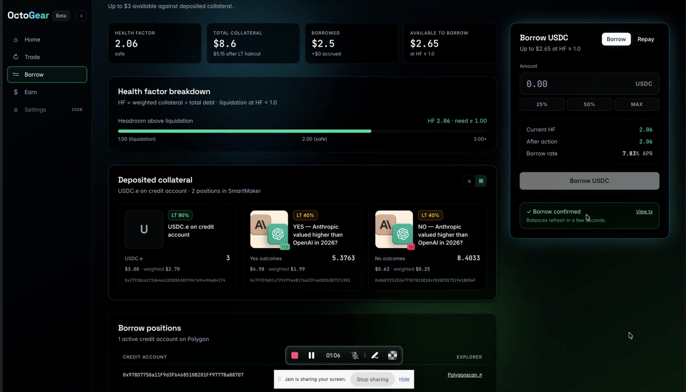

# How to Borrow

Borrowing on OctoGear lets you draw USDC against collateral held in your credit account — either USDC.e from your wallet, or Polymarket YES/NO outcome tokens you already hold.

## What you need

- A Prime Account (passkey or EVM wallet)
- At least **5 USDC.e** on Polygon for the credit account bootstrap
- **POL** for gas

---

## Step 1: Open a credit account

If you do not have a credit account, the **Home** page shows a **Get Started** card (EVM users) or the Borrow page bootstraps one for you automatically.

Opening requires two transactions:
1. Approve USDC.e to the CreditManager (one-time, sticks permanently)
2. Open the account with a small USDC seed and minimum debt

---

## Step 2: Borrow against USDC.e (no Polymarket position)

1. Go to **Borrow**
2. Enter the USDC amount you want to borrow
3. The card preview shows your projected health factor
4. Sign the transaction — USDC.e arrives in your wallet, your debt opens

---

## Step 3: Borrow against Polymarket positions

If you hold Polymarket YES/NO outcome tokens, you can use them as collateral. The flow takes up to four transactions:

| Step | What happens | One-time? |
|---|---|---|
| 1. Approve | Allow your CTF tokens to be moved by Multicall3 | Yes — sticks permanently |
| 2. Open credit account | Bootstrap with a small USDC seed | Yes — skipped if you already have one |
| 3. Deposit collateral | Transfer your YES/NO tokens into your credit account | Every borrow |
| 4. Borrow | Draw USDC from the pool to your wallet | Every borrow |

Each step is one transaction and one Touch ID or wallet prompt. After step 4, the borrowed USDC.e is in your wallet and your outcome tokens sit in the credit account as collateral.

---

## Managing your position

### Health factor

Your health factor is shown on the Home and Borrow pages. If it falls below 1.0, your position is liquidated automatically.

Prediction market collateral has a **decaying Liquidation Threshold** as markets approach resolution:

| Time to resolution | LT |
|---|---|
| > 7 days | 40% |
| 3 – 7 days | 30% |
| 1 – 3 days | 20% |
| < 24 hours | 10% |

Monitor your health factor closely in the final 72 hours of any whitelisted market. Consider repaying or adding USDC collateral before that window to reduce liquidation risk.

### Repay debt

1. Go to **Borrow**, toggle to **Repay**
2. Enter the amount to repay
3. If your USDC.e allowance to the CreditManager is insufficient, an approval step runs first — wait for it to confirm before the repay transaction
4. Sign — USDC.e returns to the pool, your debt drops

Repay any amount at any time. Interest accrues every Polygon block (~2 seconds). To repay the full balance, the app uses a small tolerance — leave a dust amount if the exact repay fails.

---

## What counts as collateral

| Asset | LT | Notes |
|---|---|---|
| USDC.e | 95% | Most capital-efficient collateral |
| Polymarket YES token | Up to 40%, decays near resolution | Must be activated on your credit account |
| Polymarket NO token | Up to 40%, decays near resolution | Must be activated on your credit account |

More collateral types are added as new markets are whitelisted.

---

## Liquidation

If your health factor falls below 1.0, a liquidator automatically closes your credit account and repays the outstanding debt from your collateral. Any remaining collateral value is returned to you. You cannot intervene once liquidation begins. Avoid liquidation by:

- Repaying part of your debt before markets approach resolution
- Adding USDC.e as additional collateral
- Not borrowing close to your maximum LTV against PM collateral with short time-to-resolution
