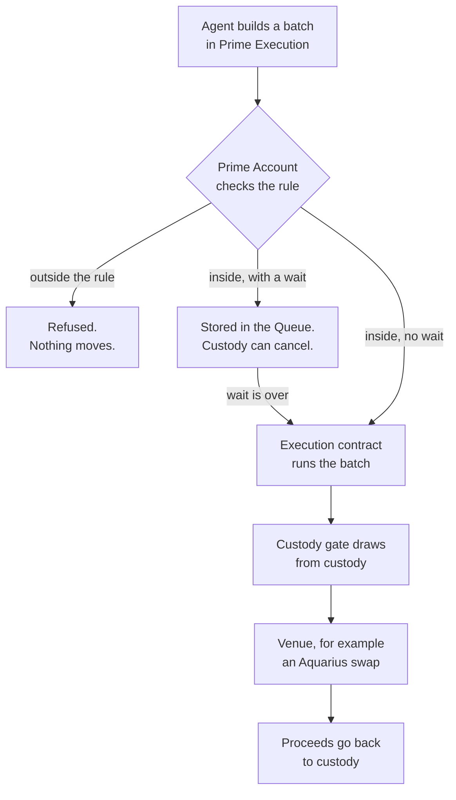

# How Prime works

Prime is one app on one account. Read from the bottom up:

| Layer | What it is |
|---|---|
| Prime app | Where you work: Accounts, Policies, Transactions with its Queue, Apps with Prime Execution, and Portfolio, which shows positions and NAV from OctoPos. |
| OctoGate | Our policy layer: the custody gate, rules and roles, the time lock, recovery and the execution contract. |
| Smart account | An OpenZeppelin smart account on Stellar. It holds the multisig signers and the approval count, and it checks every policy on chain. |

Your custody wallet sits beside this stack. The funds stay there and enter a
move only through the custody gate.

## Five pieces, each for one problem

| Piece | The problem | What it does |
|---|---|---|
| Custody gate | Funds must not leave custody | Draws only within a limit and an expiry, and pays only to listed addresses |
| Rules and roles | Operators should act without full keys | Fix the venue, the asset, the amount band and who approves |
| Time lock | Large moves need a second look | Stores a move on chain before it runs, and custody can cancel it |
| Recovery | Custody's signers can lose access | Lets the funds reach one agreed address, and only that address |
| Execution contract | DeFi takes several steps | Runs the whole batch as one checked transaction |

The app sometimes calls the execution contract the execution adapter. Both
names mean the same contract.

## The people in a setup

The walkthroughs use six wallets. Your own setup may merge or split these roles.

| Role | In the walkthroughs | What it does |
|---|---|---|
| Custody | A Stellar multisig: its own key carries 10, Signer A 5 and Signer B 5, and every transaction needs 20 | Holds the funds. Sets up the gate, grants its limits, and can cancel a stored move. |
| Signer A, Signer B, Admin | The Prime Account's three signers, any two of which can approve | Govern the account: install rules, create the execution contract, recover funds. |
| Agent | One key | Acts under its rules, and nothing else. |
| Trustee | One wallet | The recovery address. It never signs anything in Prime. |

Custody in the walkthroughs is a plain multisig standing in for an MPC wallet.
Stellar accounts carry native signing weights, so an MPC wallet's keys and Prime's
signers can share one account's thresholds the same way.

## How one move happens

1. The agent builds a batch in Prime Execution and picks the rule it acts under.
2. The Prime Account checks the batch against that rule: the venue, the amount
   band, the approvals and the minimum wait. A batch outside the rule is refused
   on chain and nothing moves.
3. If the rule asks for a wait, the batch is stored on chain and appears in the
   Queue. Until it runs, custody or the account's signers can cancel it.
4. The execution contract runs the batch: the gate draws from custody, the venue
   does its part, and the proceeds go back to custody.

All of step 4 is one transaction. If any call fails, none of them happen.

## Prime and Safe

On EVM, Safe is the familiar multisig account. Prime is that for Stellar, with
the policy layer built in.

| | Safe on EVM | Prime on Stellar |
|---|---|---|
| Multisig account | Yes | Yes, an OpenZeppelin smart account |
| Permissions per action | Add-on modules | Built in, through OctoGate |
| Time lock and cancel | Add-on modules | Built in, and custody can cancel |
| Recovery to one agreed address | Add-on modules | Built in |
| Funds stay in an MPC wallet | No: the funds move into the Safe | Yes, if you use MPC |

Prime also runs on EVM, on Base Sepolia only, where it works differently. See
[Prime on EVM](./06.prime-on-evm.md).
