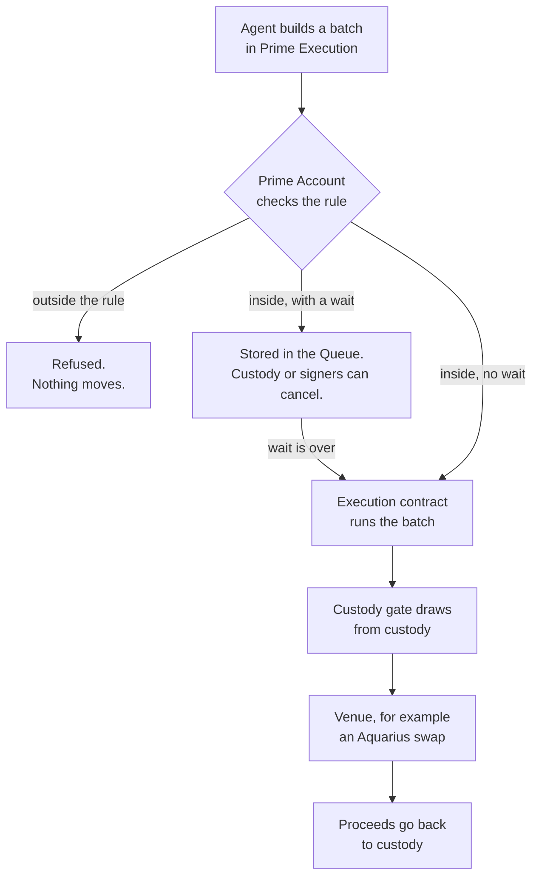

# How Prime works

A Prime Account is an OpenZeppelin smart account on Stellar. Like any multisig
it has signers and an approval count, and it checks its policies on chain before
it authorises a call. When an agent uses custody's funds, they stay in your
custody wallet, not in the account. The exception is a Blend position, held in
the account's name until it's withdrawn back to custody. The pieces below come
from our OctoGate contracts.

## Custody gate

Custody deploys the gate and grants it an allowance per asset. The gate pays out
to the addresses listed when it was created, up to the allowance, until the
allowance expires. Only one Prime Account's execution contract can call it.

## Rules

A rule lets a wallet, usually an agent's, act without the account's full
approval count. Each rule covers one venue, one direction and an amount band per move, and
says who has to approve. One agent can have several rules: in the walkthrough,
small swaps need only the Agent and large swaps also need the Admin.

A policy is a condition attached to a rule, such as its amount band; the
account checks the policy before it lets the rule authorise anything. You
install a rule with **Add a rule** on the Policies page, usually starting from a
template.

## Time lock

The gate has a minimum wait and a run window, and a rule can ask for a longer
wait. A move that has to wait is stored on chain and shows in the Queue, where
custody or the account's signers can cancel it. A move not run within the run
window lapses.

## Recovery

When the gate is created custody can name a recovery address, such as a
trustee's wallet. If custody's signers then lose their keys, the Prime Account's
signers can send custody's funds to that address.

A recovery runs under the account's own authority, which no rule checks. The
gate still pays only addresses on its list, but the list also holds the Prime
Account, custody and the venues. So at the account's full approval count, its
signers can draw custody's funds to any of those as well, within custody's
allowance. Agents can't: their rules fix where funds go.

## Execution contract

Each Prime Account has one execution contract (the app labels it "execution
adapter" in some places). It runs a batch of calls as one transaction, and
Prime Execution builds batches of up to eight calls. If one call fails, none of
them take effect.

## Roles in the walkthrough

| Wallet | Role |
|---|---|
| Custody | Holds the funds. In the videos it is a Stellar multisig that needs weight 20: its own key has 10, Signer A and Signer B have 5 each. |
| Signer A, Signer B, Admin | The Prime Account's signers. Any two of the three can approve. Signer A and Signer B are also on custody's multisig, which keeps the demo short; your custody and Prime signers can be different people. |
| Agent | Acts under its rules. |
| Trustee | The recovery address. |

A real setup would usually use an MPC wallet as custody. Its keys can sit on a
weighted Stellar account the same way Signer A and Signer B do in the videos.

## How a move runs

## Compared with Safe

On Stellar, Prime's per-action rules, time lock and recovery come from the
account and its OctoGate contracts, and the funds stay with custody. A plain
Safe holds the funds itself and adds these through modules.

There is also an EVM version of Prime built on Safe; see
[Prime on EVM](./06.prime-on-evm.md).
