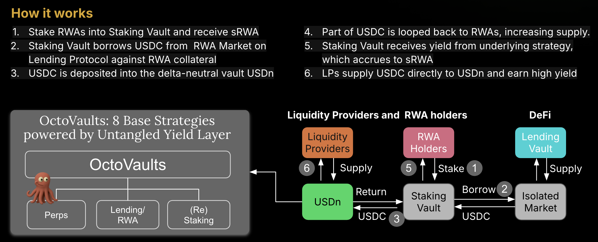

# How it works

1. Stake RWAs into Staking Vault and receive sRWA
2. Staking Vault borrows USDC from  RWA Market on Lending Protocol against RWA collateral
3. USDC is deposited into the delta-neutral vault USDn
4. Part of USDC is looped back to RWAs, increasing supply.
5. Staking Vault receives yield from underlying strategy, which accrues to sRWA
6. LPs supply USDC directly to USDn and earn high yield  

  

