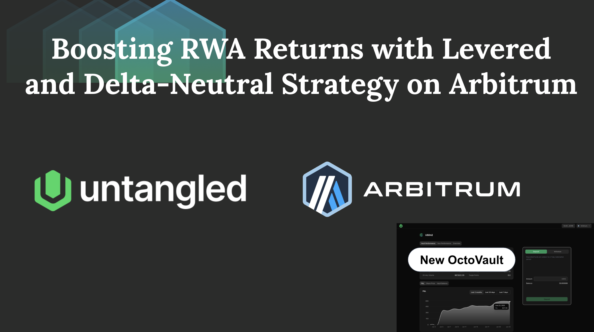

# Boosting RWA returns with delta-neutral yield stacking strategy

  

Untangled has launched the first levered, delta-neutral RWA vault. The strategy allows tokenized money market fund, private credit and other RWA holders to unlock additional returns via DeFi-native, delta-neutral yield sources. Further, liquidity providers could supply USDC directly to earn institutional-grade, uncorrelated yield through Untangled app, fintech wallets or lending vaults.

### RWA, but better
Offering an additional yield source, capturing upside in a bull cycle with higher funding rates, while providing stable returns from RWAs.

### Uncorrelated Yield
Our vault share USDn enables investors to turn digital assets (USDC or RWA) into consistent source of yield, uncorrelated to crypto volatility 

### Liquidity by Design
Beyond direct redemption, both USDn and sRWA tokens are composable across DeFi, allowing liquidity secondary trading and collateral use cases

### Any time, Any Network 
Liquidity providers can access directly via our apps or your trusted fintech apps, or via your existing vault curators 
