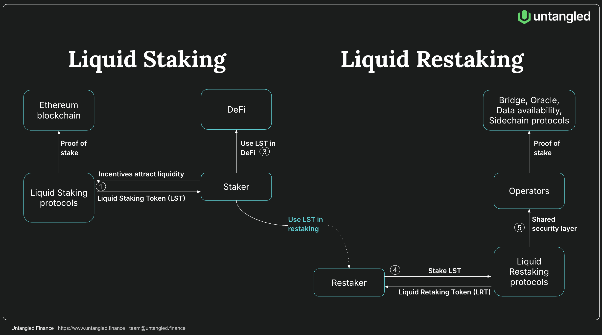

# Untangled Credio OETH Vault on Symbiotic

## Introduction
Untangled Credio is launching an OETH restaking vault on Symbiotic, a protocol enabling assets like Origin Ether (OETH) to secure multiple networks simultaneously. Stakers deposit OETH to earn its intrinsic yield (from liquid staking and DeFi) plus additional rewards from restaked networks. The vault aims to maximize risk-adjusted returns by dynamically allocating OETH across high-reward networks while managing slashing risks. This post outlines the vault’s strategy, covering network selection, reallocation logic, risk management, and governance.

You could access the vault here:  [Untangled Credio x OETH Vault](https://app.symbiotic.fi/vault/0x7B79de0cE3Fb365AAe05DFb99c26d3Da7ee85c8b) 
 
## Restaking primer

  

Since the launch in June 2023, restaking has rapidly evolved into a fully-fledged competitive sector. Restaking protocols like Eigen Layer, Symbiotic and Karak allow users to leverage Ethereum’s security by restaking their ETH and liquid staking tokens (LSTs) across multiple decentralized services (or networks).

Operators (or Actively Validated Services/AVSs) are essential in the restaking ecosystem, using restaked assets like OETH and liquid staking tokens to secure decentralized services through restaking protocols. By tapping into Ethereum’s validator set for pooled security, operators enhance the network's robustness and offer additional yield for restakers. This creates a mutually beneficial system where restakers earn more, while decentralized applications gain cost-effective security, driving both ecosystem growth and yield generation.

## Overview of Symbiotic
Symbiotic provides a modular and flexible framework for restaking:

  

Vaults (with curator) delegate any collaterals (ERC20) to networks via operators with one of the following models: 
(1) Multiple networks, multiple operators 
(2) Multiple networks, single operator 
(3)Single network, multiple operators and 
(4) Single network, single operator

Single-token vaults comprise mainly of ETH/ETH derivatives, wBTC and some yielding stablecoins. Thus most of the collaterals are volatile.
So far there are around 70 vaults, 66 operators providing economic security to 15 networks
