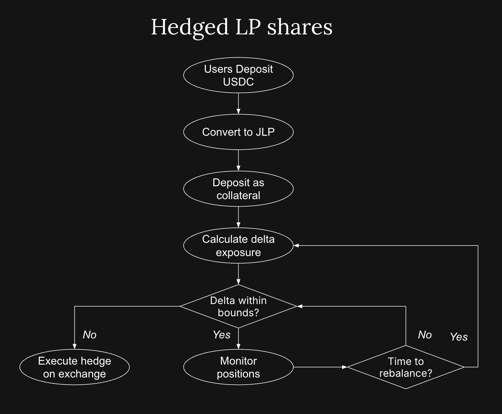

# Strategy Vault through a Hedged Liquidity Pool Model

Delta-neutral vaults aim to exploit inefficiencies in perp markets, especially during sustained imbalances in open interest and funding. This is distinct from directional exposure (e.g., long-BTC), staking-only strategies, or passive ETF-style products.

By combining a yield-bearing LP position with a managed short hedge, delta-neutral vaults offer:

Positive carry through trading and funding fees
Neutral price exposure
Performance resilience across market cycles
A representative implementation is the **Hedged Liquidity Pool Model**:

  

- LPs deposit into a perp exchange liquidity pool (e.g., JLP on Jupiter)

- Vault monitors token weights (e.g., 50% SOL, 30% ETH, 20% BTC)

- Vault shorts the same assets on the same or another perp exchange

**Objective: neutralize delta while capturing yield from both sides**
