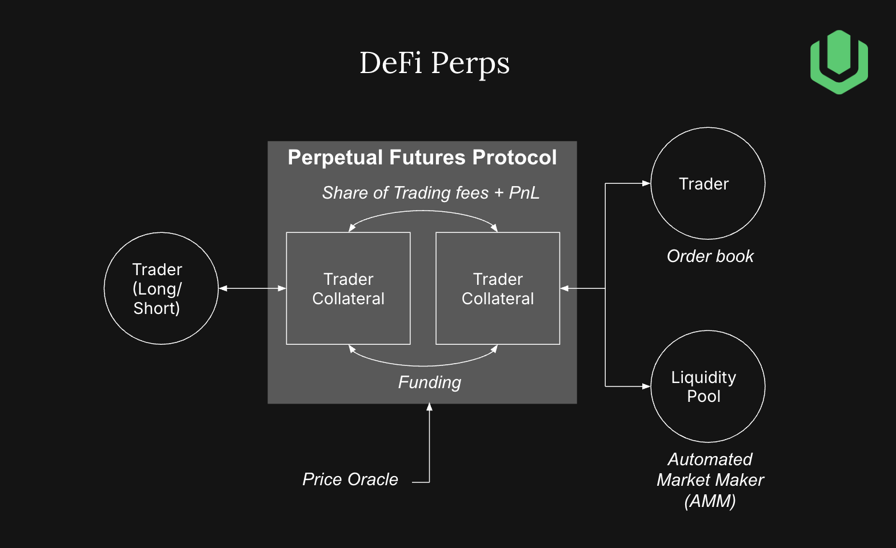

# Delta-Neutral Yield Strategies in Perps

When a trader opens a position on a perp DEX, their trade is matched against either another trader (via orderbook), a liquidity pool (via AMM), or a hybrid system. These design choices affect hedging accuracy, slippage, and rebalancing frequency

  

