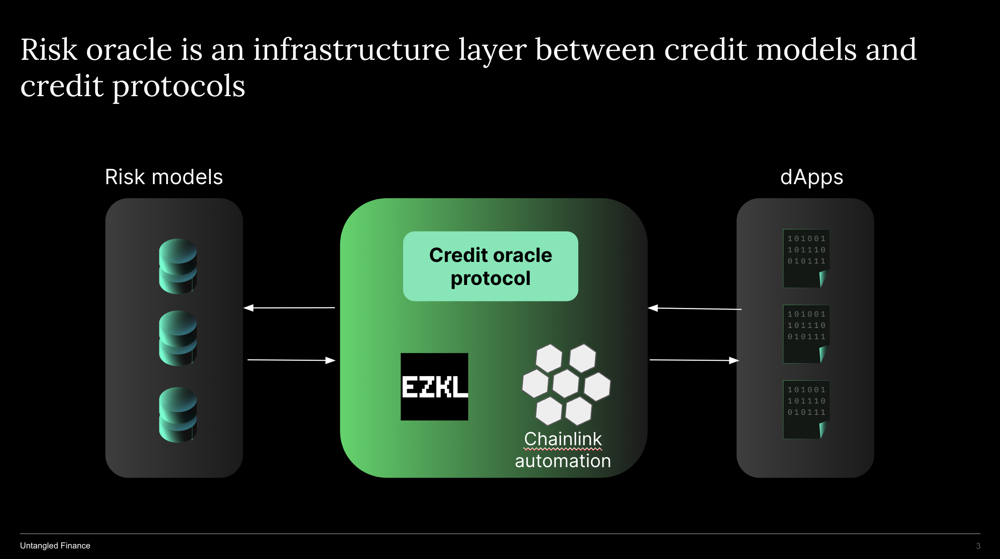

# Introduction to credit oracle
Untangled develops Credit Oracle, a real-time credit oracle powering on-chain lending with AI-driven risk models and zero-knowledge proof. We build Untangled on the conviction that much of RWA financing will be tokenized requiring robust credit infrastructure to scale. The credit oracle is a major missing piece  in RWA DeFi today.

## Health factor in DeFi lending
In any collateralised lending it is important to establish the price of collaterals as it directly impacts the recoverability of the loan. This is the concept of collateral ratio (value of collateral / loan amount). When collateral ratio drops to a certain level say from 150% to 110% collateral will be liquidated and the proceeds being use to repay the loan. 

All major DeFi lending protocols like Aave, Compound Maker work like that. However in order to work out the collateral ratio, they need to know the current price of collateral. This is where Chainlink comes in. Chainlink provides price feed on a real time basis so that the protocols can maintain their financial health through the monitoring of the collateral ratio. 

The above protocol has one thing in common: their collaterals are crypto natives like ETH or BTC. Whilst the collateral themselves are volatile in prices, there are deep markets for them, making prices highly observable. 

## Stage of RWA collateral monitoring
For RWA lending protocols they, like the above, also need to monitor their health through the collateral. However the difference is that RWAs, while less volatile, do not have on chain or secondary markets where prices can be easily observed. 

So for RWA lending protocols if they want to value collateral they need to use a ‘fair value’ approach based on credit modeling using statistical or machine learning approaches. These models generate ‘prices’ (or probability of default) for the credit collaterals which could then be fed into the collateral ratio above.  

The issue is that not many RWA lending protocols do or have the ability to value and monitor these RWA collaterals. As a result, the market has seen major defaults among many RWA pools to date. 

## Credit modeling 
In TradFi the credit modeling or rating function is performed by the rating agencies such as Moody’s, S&P, Fitch. Any debt issuance in the public will need to have a credit rating. In DeFi this is non-existent. 

A number of players have started to provide credit rating, modeling in DeFi. Untangled also built a machine learning credit modeling capability that is providing credit prices for our own credit pools. This is a differentiation among all existing RWA credit offerings in DeFi. 

## Credit oracle
However, just like chainlink themselves is not the only source of native token pricing, Untangled would like to decentralize the credit modeling/pricing such that any organizations with expertise in specific asset classes or the big rating agencies of the world can also provide the credit prices for those RWA protocols. However in order to feed those credit prices into smart contracts an infrastructure layer needs to be developed. If chainlink built an infrastructure for feeding crypto native token prices the Untangled is building an credit oracle infrastructure  to feed credit price directly in smart contracts in real time. 

So Untangled is the provider of the credit oracle. However in building this infrastructure layer we collaborate with Chainlink given their expertise in building oracle and the technologies chainlink provides such as Automation or Functions. 

Untangled also works with Chainlink to bundle their proof of reserve offering with the credit oracle. With this bundled solution RWA lending protocols not only know the price of the RWA collaterals but also their existence. 

One of the largest RWA lending protocols is Maker. The lack of on-chain monitoring in regard to the existence of the collateral and their prices was what stopped Maker in lending based on private credits but to focus on US treasuries instead. 
