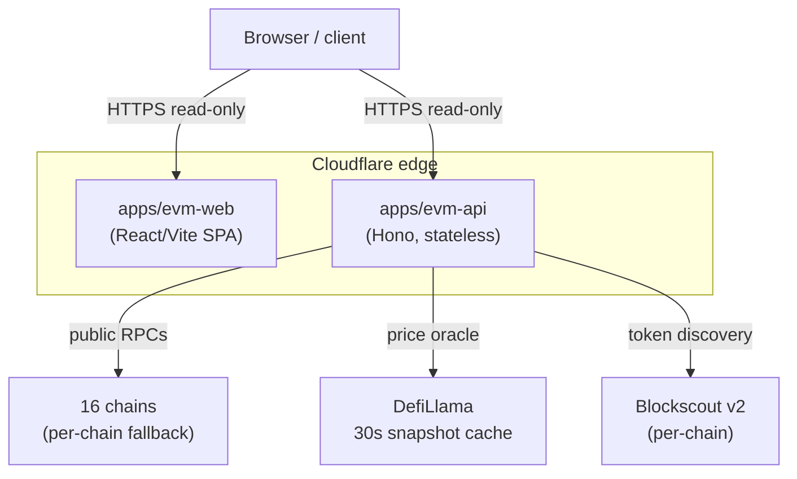

# OctoPos EVM — Overview

**Mainnet, V8.3 (2026-06-19).** Multi-chain EVM position monitoring — public, read-only, no API key required.

## What it is

OctoPos EVM is a parallel product surface to OctoPos Stellar. It exposes a stateless REST API and a web app for monitoring DeFi positions, ERC-20 balances, and activity across 16 EVM chains.

:::tip
The EVM stack is a **separate product surface**, not a port of Stellar. It runs on its own two Cloudflare Workers (`apps/evm-api` + `apps/evm-web`) and shares only the `ui-kit` package with the Stellar side. The two surfaces do not share databases, KV, or auth at runtime.
:::

:::note
All endpoints are public, read-only, and stateless. No API key, no auth header, no x402 settlement. Rate limits are per-process and reset on Worker isolate restart.
:::

## Live deployments

| Surface | URL | Notes |
|---|---|---|
| EVM Web | `https://app-evm-octopos-mainnet.crediolabs.ai` | Also accessible via `app-evm-octopos-mainnet.untangled.finance` |
| EVM API | `https://api-evm-octopos-mainnet.crediolabs.ai` | Also accessible via `api-evm-octopos-mainnet.untangled.finance` |

Health check:
```bash
curl https://api-evm-octopos-mainnet.crediolabs.ai/healthz
# → ok
```

## Architecture



The EVM API worker has **no bindings** — no KV, no Hyperdrive, no Durable Objects. Caching is in-process: 30s positions cache + 30s DefiLlama price snapshot, both reset on Worker isolate restart.

## Version status

**V8.3** is the current shipped cycle, deployed to mainnet 2026-06-19. Key changes in V8.3:

- 30-second DefiLlama price cache (bit-exact identical totals within window)
- Per-call multicall retry with exponential backoff (300/600/1200ms, max 3 attempts)
- Token discovery on 16 chains via Blockscout v2
- LP discovery on 7 chains
- 16 DeFi protocol adapters on Ethereum mainnet

## Reference test wallet

**Binance 8** — Ethereum, ~$10.4B / 54 positions on V8.3. Stable across the 30s price cache window. Used internally as the canonical cross-check wallet against DeBank and Dune Sim.

## Cross-links

- [Supported chains](./supported-chains) — 16 supported + 9 deferred
- [Capabilities and endpoints](./capabilities) — 8 endpoints + 16 adapters
- [Untangled OctoPos engineering docs (feat/evm-port)](https://github.com/untangledfinance/octopos/blob/feat/evm-port/docs/evm-coverage.md) — chain-by-chain adapter matrix, per-protocol coverage, structural gaps
- [System architecture](https://github.com/untangledfinance/octopos/blob/feat/evm-port/docs/system-architecture.md#evm-surface-parallel-to-stellar) — Workers topology, EVM/Stellar isolation model
