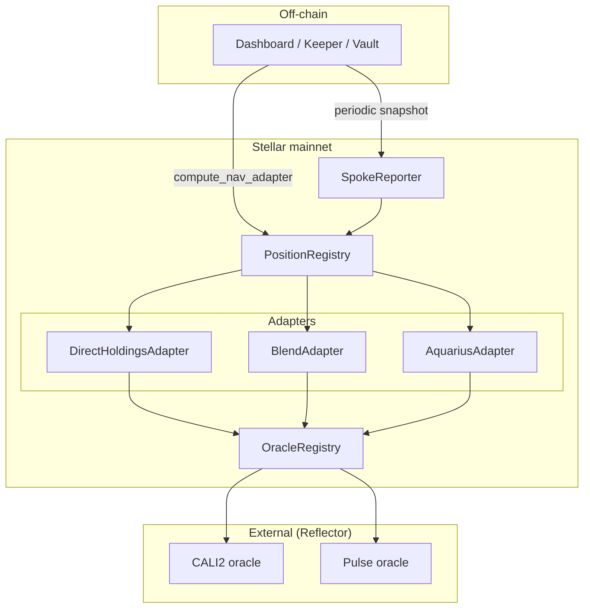
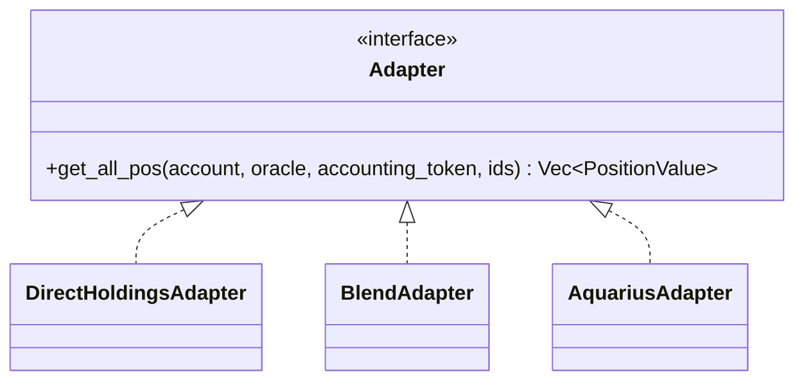
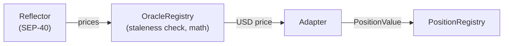

# Architecture

## Block Diagram

## Adapter Pattern

Each protocol is a separate Soroban contract that exposes the same interface. PositionRegistry only knows about adapters by `protocol_id`, so adding a new protocol is a deploy-and-register, not a redeploy of the registry.

`PositionValue` is a flat record per position holding `{ value: i128, is_debt: bool }` in the accounting token's scale.

## Trust Boundary

OracleRegistry is the single trust boundary for prices. Reflector's raw output is staleness-checked before any adapter sees it.
