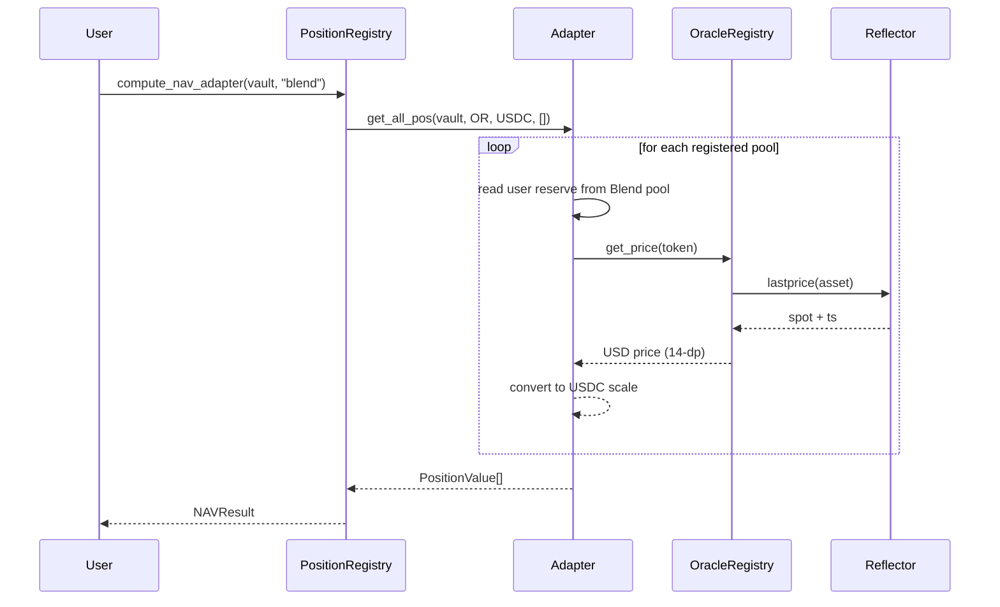

# How NAV is Computed



## Two NAV Entry Points

| Method | Best for | Trade-off |
|---|---|---|
| `compute_nav` | Single call NAV across all adapters | Hits the 100M-instruction CPU budget at 3+ adapters |
| `compute_nav_adapter` | Per-adapter results, summed off-chain | Requires N invocations, but always within budget |

In production today, dashboards and monitors use `compute_nav_adapter`.

## Result Schema

```
NAVResult {
    total_nav         (i128, 6-dp USDC)  // assets − liabilities
    total_assets      (i128)
    total_liabilities (i128)
    is_underwater     (bool)
    positions_count   (u32)
    timestamp         (u64)
}
```
