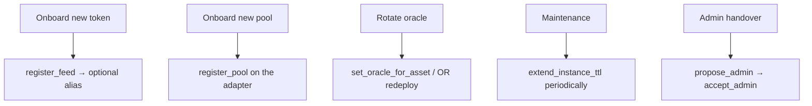

# Operations

For step-by-step CLI commands, see the deployment guide.

## Common Runbook Items

## Maintenance Schedule

| Item | Cadence | Owner |
|---|---|---|
| `extend_instance_ttl` (each contract) | Quarterly | Keeper / admin |
| Verify NAV vs OctoPos | Weekly | Ops |
| Audit feed list & aliases | After each onboarding | Admin |
| Reflector price liveness | Continuous | Keeper alerts |
