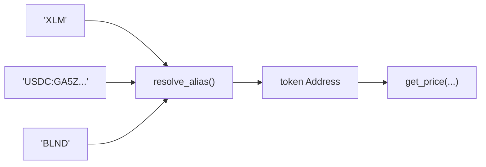

# Oracle Alias System

OracleRegistry stores a `String → Address` map so callers can refer to tokens by symbol or asset code:

## Supported Key Shapes

| Pattern | Example |
|---|---|
| Token symbol | `XLM`, `USDC`, `AQUA`, `yXLM` |
| Contract address | `CAS3J7GY...` |
| Classic asset (`CODE:ISSUER`) | `USDC:GA5ZSEJY...` |
| Any opaque string | `BLND`, `LP-pool-12` |

Aliases never replace feeds. Each resolved address must still have a `register_feed` entry. Alias APIs are convenience indirection only.
