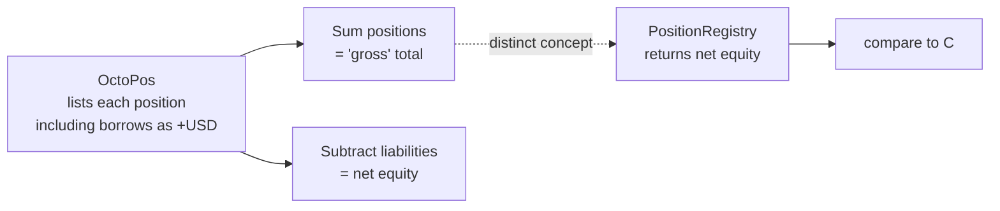

# Verification

## Vault Under Test
`GAFBNJTWT6WX3A65IY62ZOUWPFC5VQAHC5PCB5SV23ZKOMHKEFJFQSGC`

## NAV Reconciliation (Snapshot 2026-05-13)

| Source | Direct/Wallet | Blend (net) | Aquarius | Total |
|---|---:|---:|---:|---:|
| **PR.compute_nav_adapter** | $20,744.71 | $129,654.17 | $1,817.91 | **$152,216.79** |
| OctoPos (gross assets only) | $20,727.28 | collateral $146,749.98 | $1,815.36 | $169,292.62 |
| OctoPos (− borrow $17,454.31) | — | — | — | $151,838.31 |

**Delta vs OctoPos (net equity):** ~$378 (~0.25%). Source of error is mostly timing of price updates between Reflector and OctoPos's pricing source, plus rounding to 6-dp USDC.

## What We Mean by "Matches"

OctoPos's "portfolio total" is the sum of all positions' raw USD values (positive sign even for borrows). NAV in the financial sense is **net equity** (assets − liabilities). PositionRegistry returns the latter, which matches OctoPos's net once the borrow line is netted out.
