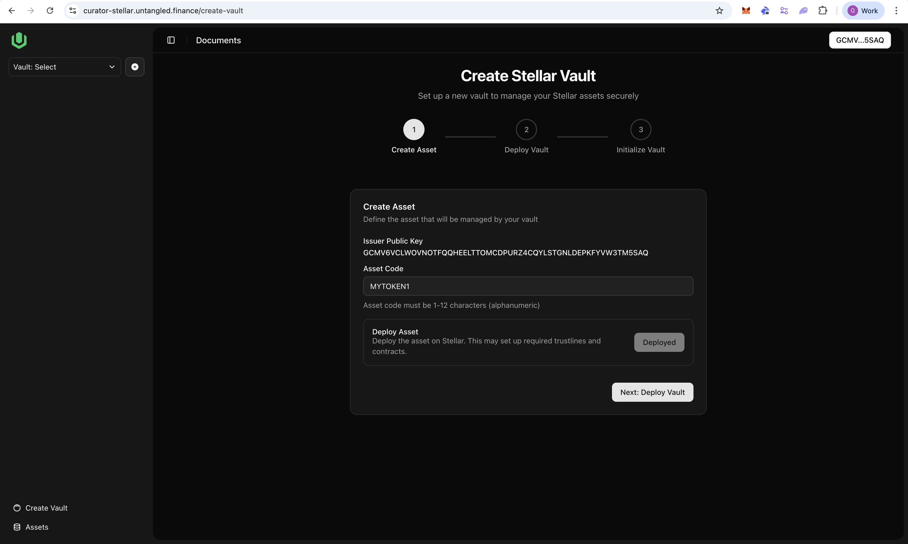
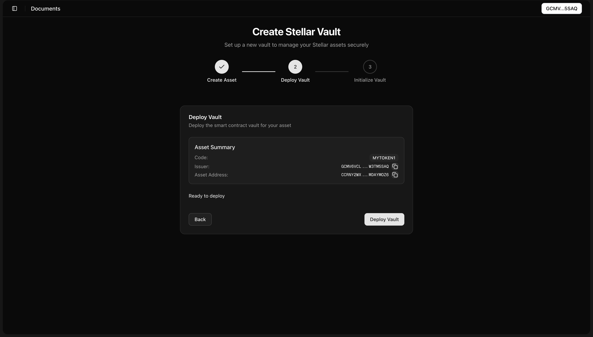
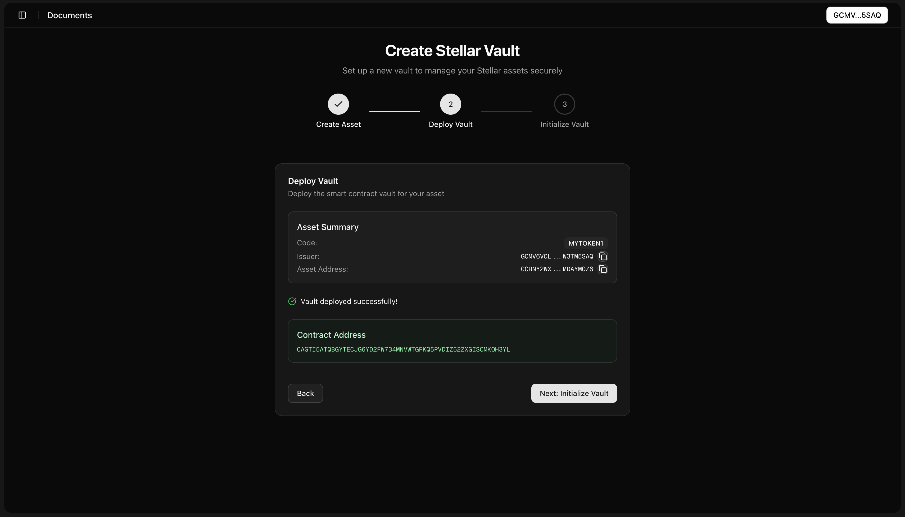
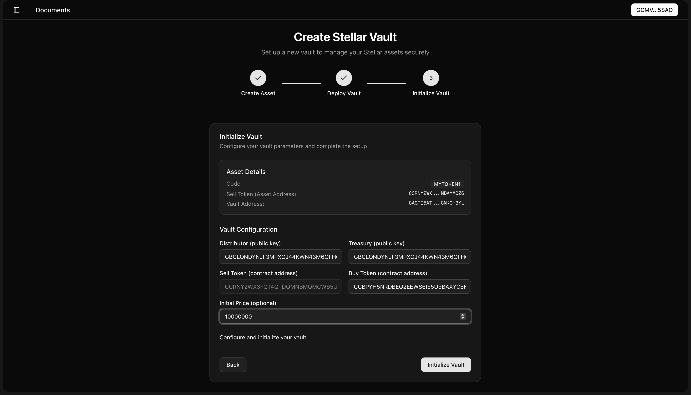
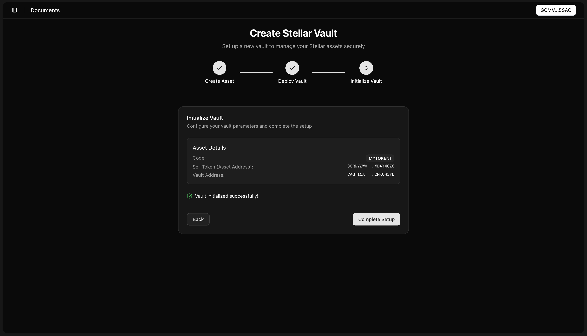
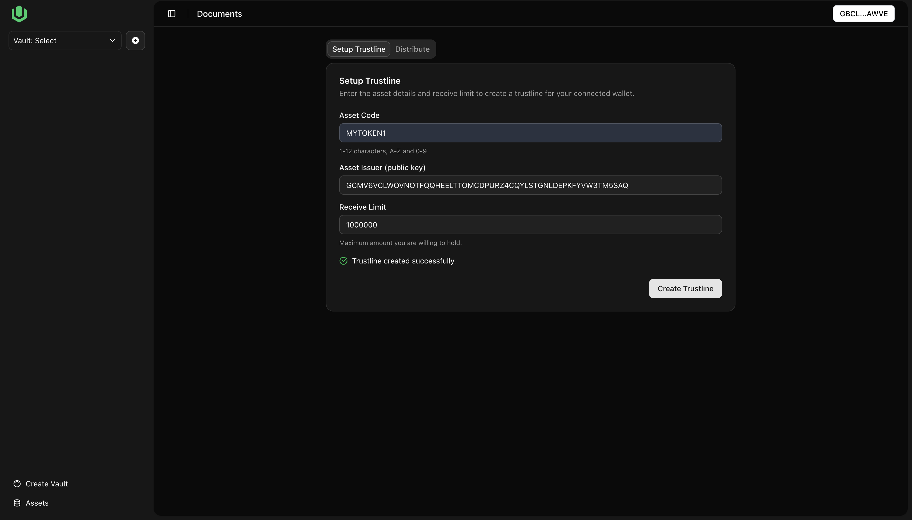
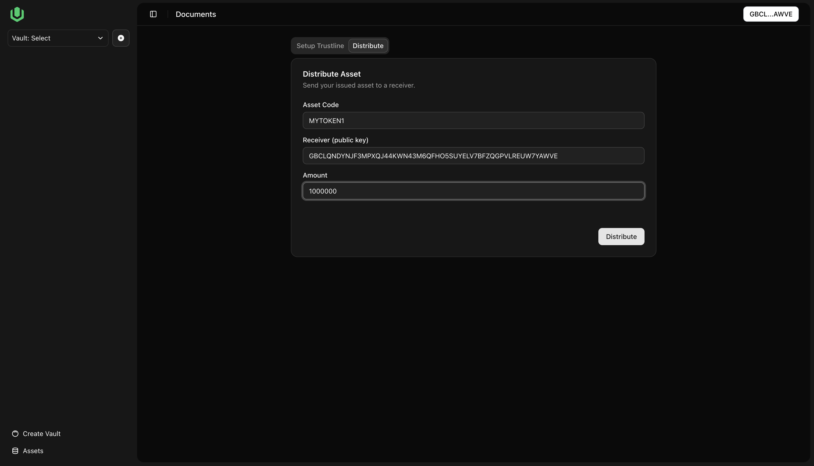
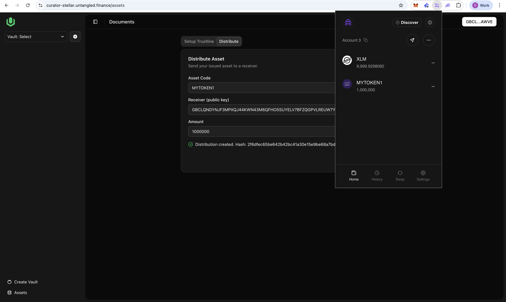

# User Guide: Create Asset, Deploy Vault, Initialize Vault

## Prerequisites

- Install and unlock the Freighter wallet.
  
- Connect your wallet in the app (switching accounts will reload the page).

- Ensure your wallet has enough XLM for fees.

## Step 1 — Create Asset

- Issuer: Auto-filled from your connected wallet.
  

- Asset Code: Enter 1–12 uppercase alphanumeric characters (e.g., MYTOKEN).

- Click “Deploy Asset”.
  - The app deploys the SAC contract for your asset.
  - On success, you’ll see “Deployed” and the Contract Address (saved as `assetAddress`).

- Click “Next”.

## Step 2 — Deploy Vault

- Review summary: Code, Issuer, and Asset Address (copy buttons available).
 
  
- Click “Deploy Vault”.
  - On success, the vault contract address is saved as `vaultAddress`.

- Click “Next”.

## Step 3 — Initialize Vault

- Distributor: G… public key responsible for distributions.

- Treasury: G… public key for vault treasury.

- Sell Token: Contract address of the shares token you have just created.

- Buy Token: Contract address of the asset that you accept to be underlying.

- Initial Price (optional): The initial price for your shares (7 decimals)
 

- Click “Initialize”.
  - Watch status: Initializing → Success/Error.

- Continue or complete the flow after success.

## Assets Page

- Setup Trustline: Enter Asset Code, Asset Issuer, Receive Limit to add a trustline.
 

- Distribute: Enter Asset Code, Receiver (public key), Amount to send tokens.
 

- On success, you will see the token in the Distributor account
 

## Tips and Troubleshooting

- Receivers must have a trustline for your asset before receiving it.
- If deployment/initialization fails, check wallet connection, network, and balance; then retry.
- Save both addresses:
  - Asset Contract Address: `assetAddress`
  - Vault Contract Address
