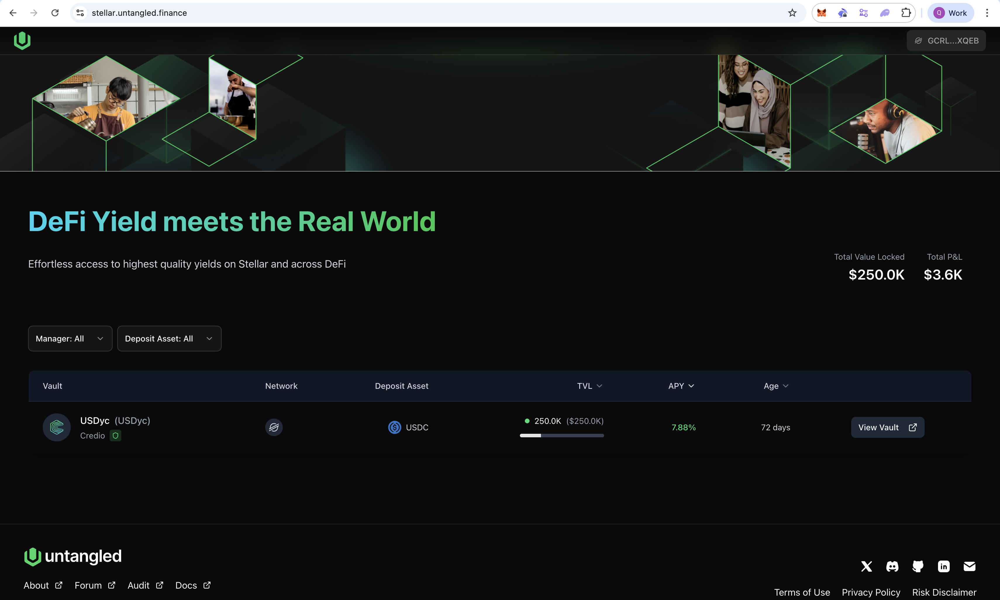
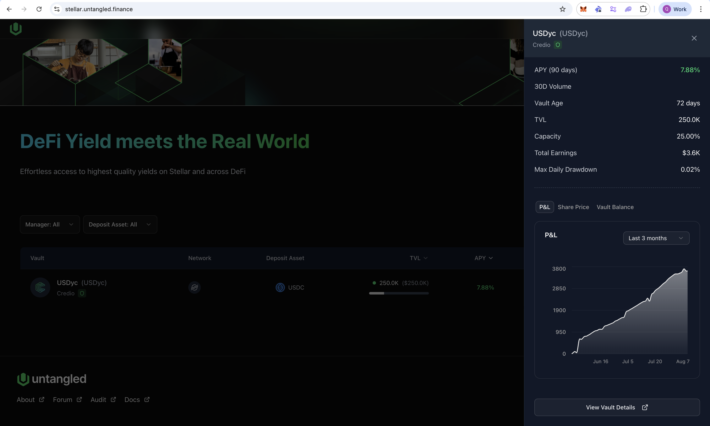
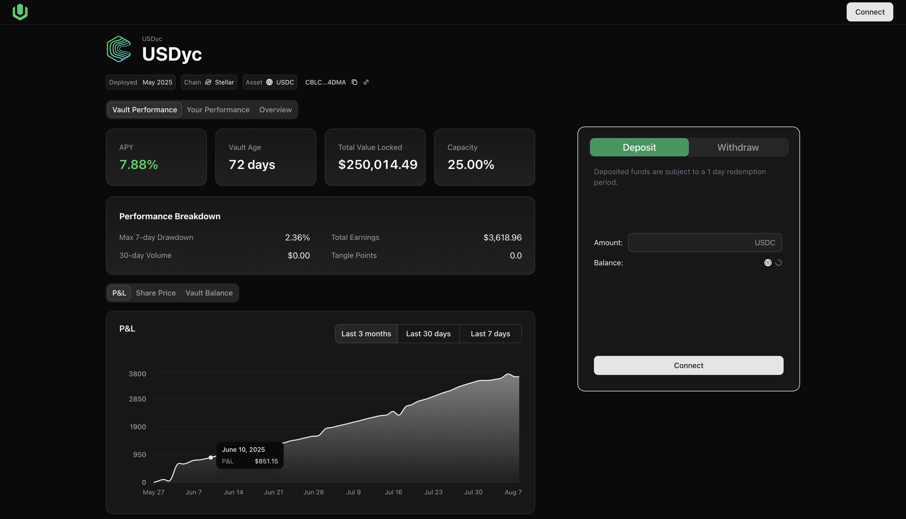
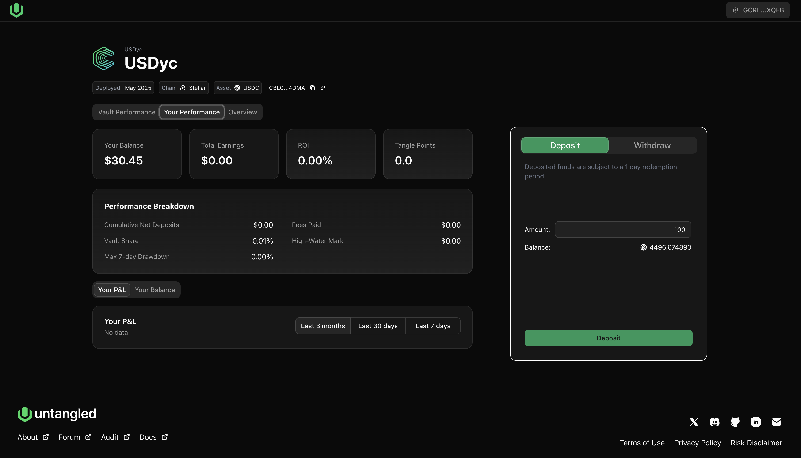
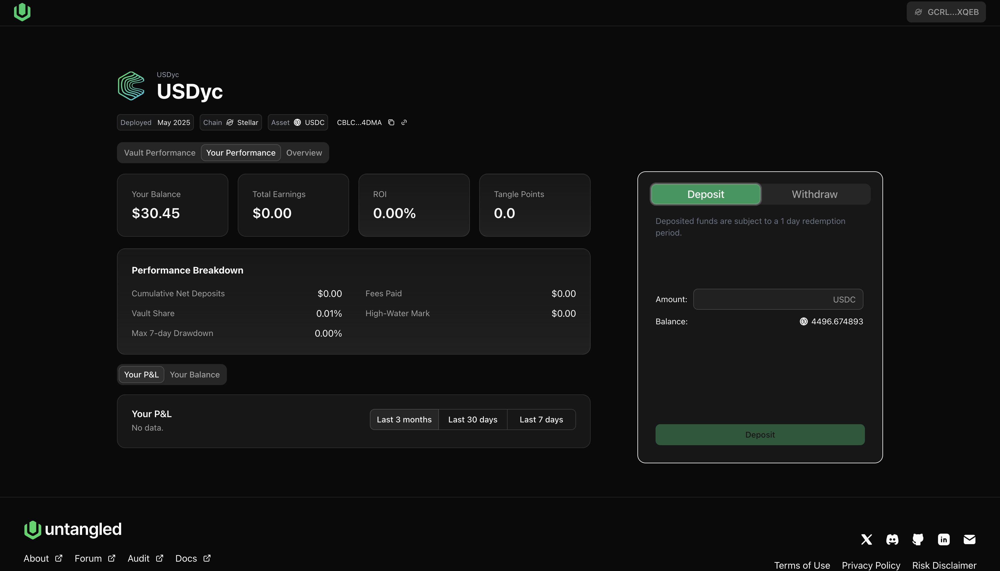
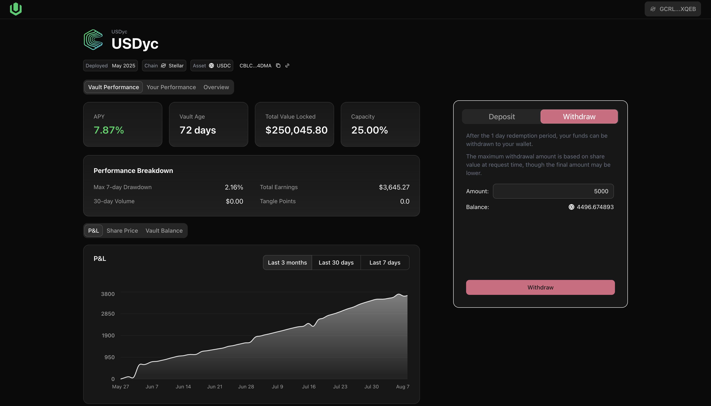

# How to Supply
## Explore a vault

On [Untangled Stellar App](https://stellar.untangled.finance) or (Untangled EVM App)[https://app.untangled.finance] you can explore all strategy vaults currently open for investment.

Click on a vault to view its summary sheet.

Apart from the vault's summary information such as active Chain, Deposit Asset, TVL, APY and Age, its summary sheet also show performance charts (PnL, Share Price, Balance and Max Drawdown during the last 7, 30, 90 days.

## Select a Vault

Choose a vault from the list to view its details and to make deposit.

### Connect wallet

- On Stellar we support [Freighter wallet](https://chromewebstore.google.com/detail/freighter/bcacfldlkkdogcmkkibnjlakofdplcbk?hl=en). You might need to download the Chrome extension and complete the account opening and funding process before connecting the wallet to the app

- On EVM chains, we support all popular wallets including MetaMask, WalletConnect, Phantom.

- Connect your wallet

### Deposit 
- The investment capacity for the selected vault is not already filled.

- Enter the amount you would like to deposit in the deposit box
  

- Sign wallet transactions: Note there are 2 operations to sign: first is to approve spend (add Trustline on Stellar) and second is to deposit. On EVM, there are also 2 transactions for any new wallet interacting with the vault. For existing wallets, only 1 transaction: deposit is needed.  

## Manage Your Portfolio

### View Your Balance
To view your balance in the vault, click on "Your performance" tab:

### Withdrawal Process
If you hold vault share tokens (e.g. USDyc), you have the option to withdraw and claim your capital and earnings. Note that each vault has it own withdrawal epoch. For USDyc, it is maximum 24 hours.

Step 1: Make withdrawal request
Navigate to a vault's page, click on the "Withdraw" tab, enter the withdrawal amount and approve and submit your withdrawal request.

Step 2: Manage your withdrawal requests
You can cancel your withdraw request any time up until the epoch close. After the epoch is open again, you will be able to see the available liquidity ready for withdrawal. You can click claim to move the liquidity to your wallet
