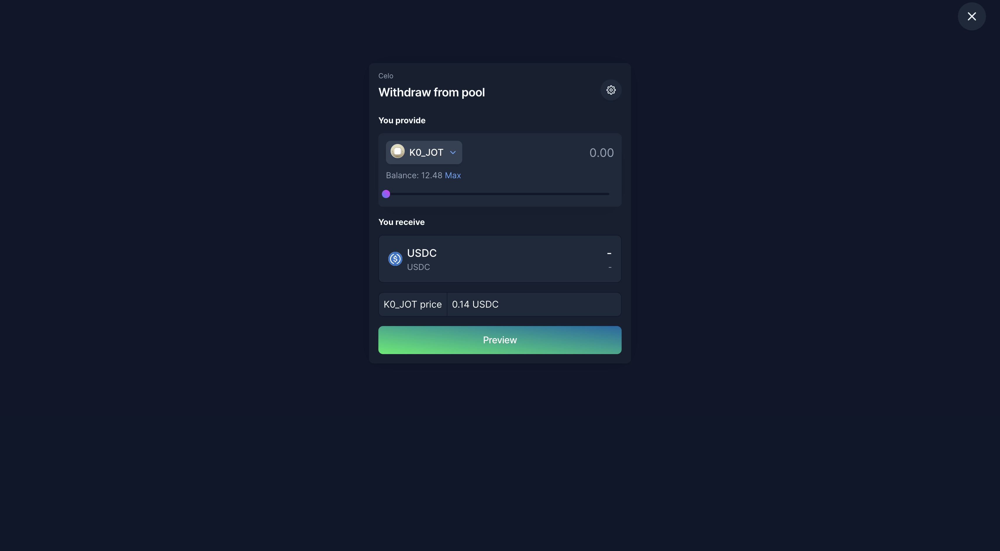
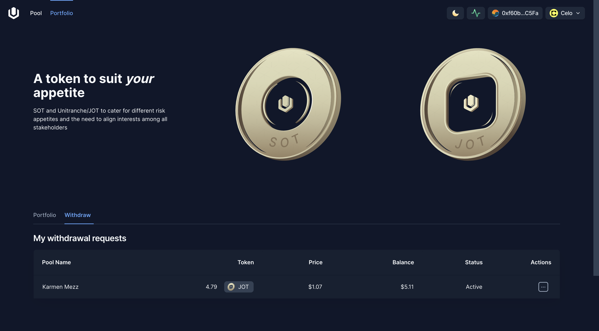

# Deposit and Withdraw
## Explore a vault on Stellar

On [Untangled App](https://stellar.untangled.finance) you can explore all strategy vaults currently open for investment.

Click on a vault to view its summary sheet.

Apart from the vault's summary information such as active Chain, Deposit Asset, TVL, APY and Age, its summary sheet also show performance charts (PnL, Share Price, Balance and Max Drawdown during the last 7, 30, 90 days.

## Select a Vault

Choose a vault from the list to view its details and to make deposit.

### Connect wallet

- On Stellar we support [Freighter wallet](https://chromewebstore.google.com/detail/freighter/bcacfldlkkdogcmkkibnjlakofdplcbk?hl=en). You might need to download the Chrome extension and complete the account opening and funding process before connecting the wallet to the app

- Connect your wallet   

  

### Deposit 
- The investment capacity for the selected vault is not already filled.

- Enter the amount you would like to deposit in the deposit box
  

- Sign wallet transactions: Note there are 2 operations to sign: first is to approve spend (add Trustline on Stellar) and second is to deposit  

  

## Manage Your Portfolio

### View Your Investments
View all your investments on Untangled via the Investor app's Portfolio section.

### Withdrawal Process
If you hold pool note tokens (JOT or SOT), you have the option to withdraw and reclaim your capital and earnings.

Step 1: From your Portfolio, select the investment you wish to withdraw. Alternatively, from a pool's page, click on the "Withdraw" option for pool notes.

Step 2: Enter the withdrawal amount.

Step 3: Approve and submit your withdrawal request.
The withdrawal is submitted and will be executed automatically when the [epoch](../securitization-on-blockchain#epoch) ends.

:::tip
You can make only 01 withdrawal request for each pool note token.
If you want to change the withdrawal request, please cancel the existing one and create another request.
:::

Step 4: Manage your withdrawal requests
All you withdrawal requests can be found under the tab Withdraw.

It may take several epochs until your withdrawal is fully paid, based on the pool reserve.
Unfulfilled withdrawal amount will be rolled over to the next epoch until it is fully paid, or cancelled by the Investor.

