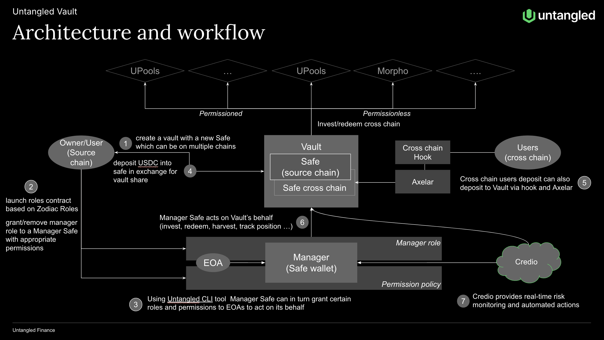

# Introducing Untangled Vault

Earlier this year, we launched Untangled Pool, a tokenized private credit platform that bridges institutional-grade assets to DeFi. It enables RWA originators of invoice finance, SME loans, and emerging market credits to access the global capital market via crypto infrastructure.

Tokenized private credit is among the growing yield opportunities in DeFi. However, other yield opportunities also exist, such as over-collateralized lending, liquid staking, restaking, and liquidity provision, all of which are accessible to DeFi investors. The growth of DeFi has attracted TradFi investors to this new asset class as well.

Investors, regardless of their background—crypto-native or TradFi—often seek:
- A safe, easy way to invest and custody their holdings
- "All market" access (i.e., any protocol on any chain that fits their risk-return appetite)
- Ability to react quickly to fast-changing market conditions and security incidents such as hacks
- Regulatory compliance, particularly regarding RWAs or TradFi investors
- Avoidance of principal-agent problems when third parties are advising or managing assets on their behalf

Today, we introduce Untangled Vault, a non-custodial, cross-chain portfolio management solution: a data-driven, automated vault designed to attract liquidity and invest in opportunities across any EVM network to match diverse risk/return appetites.

## Specifications

In designing Untangled Vault, we address these objectives by:
- Leveraging robust, battle-tested technologies
- Enabling multichain functionality for deposits and investments across all EVM chains
- Integrating Credio and AI agents—adding risk oracle (Credio) and AI capabilities
- Making limited modifications to support RWA investments, such as KYC and structured withdrawal processes
- Providing non-custodial functionality with clear roles and permissions for third parties like risk curators or asset managers

## Safe

The most battle-tested multisig wallet solution, with over 100 billion transactions, securing $100 billion+ in digital assets. Safe is widely adopted by DAOs and increasingly by institutional investors.

- Most DAOs operate around a Safe, and it has developed a suite of tools for DAO treasury management, such as Zodiac Role Extensions, which allow fine-grained role allocation and permission setups.
- Recent developments include account abstraction and multichain support with consistent wallet addresses, making it easier for investors to onboard and access opportunities across 15 different blockchains instantly.
- While Safe has significant advantages, it was designed primarily for holding and investing in digital assets, not for fundraising from investors. This role is served by the tokenized vault.

## Tokenized Vault

Since its introduction in 2022, the ERC-4626 standard has been adopted by top DeFi yield protocols like Yearn, Morpho, and Balancer. Its popularity is due to:
- Standardization of Yield-Bearing Assets: ERC-4626 defines a standardized interface for tokenized vaults, enabling consistent representation of yield-bearing assets across different protocols.
- Interoperable Deposit and Withdrawal Mechanisms: With a uniform interface for deposits and withdrawals, ERC-4626 creates a smoother user experience and increases composability, making it easier to build complex DeFi products.
- Enhanced Transparency and Efficiency: The standard includes functions to calculate share prices and yield rates, improving transparency for users, who can better understand the value of their investments over time.

## Untangled Vault = Safe + ERC-4626
Untangled Vault is built on Safe, a tokenized vault standard with extensions for a wide range of use cases.

### Vault Extensions
- Permissioned Access: Option for depositors in the vault to go through KYC verification first.
- Asynchronous Withdrawals: A close epoch to source liquidity to fulfill withdrawal requests. Once requests are filled, the epoch will reopen for users to claim withdrawals.
- Cross-Chain Communication via Alexia: 
-- Deposits: A hook contract enables depositors to deposit from their chain of choice. Once confirmed, a cross-chain message will mint the share into the investor’s wallet on the source chain.
-- Asset Updates: Position and price data of assets in cross-chain wallets are communicated to the vault on the source chain.
- Fee setting: Function allow an external manager/curator to set and receive fees for their service 

## Architecture and work flow
Untangled Vault is built on Safe and the tokenized vault standard with extensions for a wide range of use cases.

1. A new vault is issued with a new Safe. The multisig wallet can be deployed on multiple chains with the same address, enabling cross-chain execution and asset management.
2. Using Untangled CLI, the Vault Owner launches a roles contract. Appropriate roles and permissions are set up, including a Manager role granted to a Safe wallet (Manager Safe). With Zodiac Roles (a Safe extension), fine-grained roles and permissions can be established, such as an allowlist of protocols, functions, call parameters, and transaction limits. The roles smart contract is viewable/monitored by anyone and prevents the Manager from any actions that have not been pre-approved, such as withdrawing funds. Roles and permissions are consistent across all Vault Safes (source chain or cross-chain).
3. Manager Safe can further delegate specific permissions to EOAs (Externally Owned Wallets) controlled by humans or AI Agents to ensure that certain actions can be executed swiftly and safely in response to changes in market conditions.
4. Users, including client protocols and DAO treasuries, deposit funds into the Vault in exchange for Vault shares. Funds are kept in the Vault Safe, which is non-custodial.
5. Cross-chain users can also deposit to the Vault via a Hook contract into the cross-chain Safe. Axelar General Messaging relays the message to the Vault on the source chain to trigger the minting of shares to be transferred to the user's wallet on the source chain. Axelar is also responsible for cross-chain messaging of asset positions in the cross-chain Safe
6. Manager Safe executes transactions on the Vault's behalf to invest, redeem, or harvest according to the pre-defined permissions.
7. Credio, Untangled's risk oracle service, provides near real-time monitoring and risk management of the Vault, again within the permissions granted to Manager Safe. 

## Conclusion
Untangled Vault leverages ERC-4626 tokenized vaults and Safe multisig technology to tackle the complexities of DeFi investment.
- Safe, easy way to invest and custody their holdings: With Safe’s secure multisig custody, Untangled Vault provides investors with a battle-tested tool for investing and safeguarding assets. ERC-4626 allows for straightforward deposits, withdrawals, and tracking of holdings.
- “All market” access: Untangled Vault can access opportunities on any EVM chain, and with cross-chain hooks, it can attract liquidity across chains seamlessly.
- Ability to react quickly to fast-changing market conditions and security incidents: Untangled Vault integrates natively with Credio, an Untangled solution, to monitor assets and respond near-real-time to evolving market conditions.
- Regulatory compliance, especially for RWAs or TradFi investors: Only KYC-verified and accredited investors can access certain vaults. Like Untangled Pool, they can mint an NFT upon completing the onboarding process, ensuring compliance.
- Avoidance of principal-agent problems with third-party management: Through Safe’s permissioned, role-based modules (e.g., Zodiac), Untangled Vault allows controlled delegation to professional asset managers or curators, ensuring they operate within strict guidelines aligned with the Vault’s objectives, minimizing risks of misaligned incentives.
