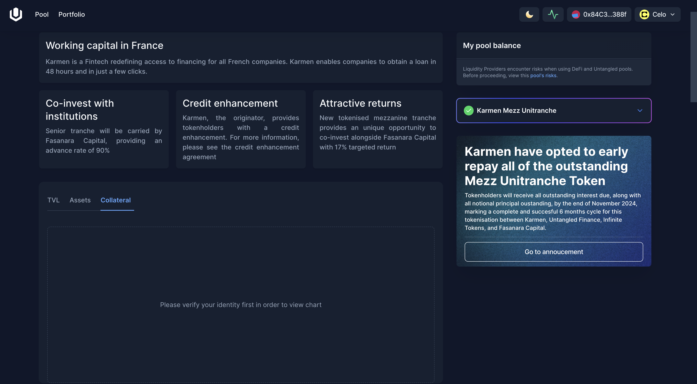
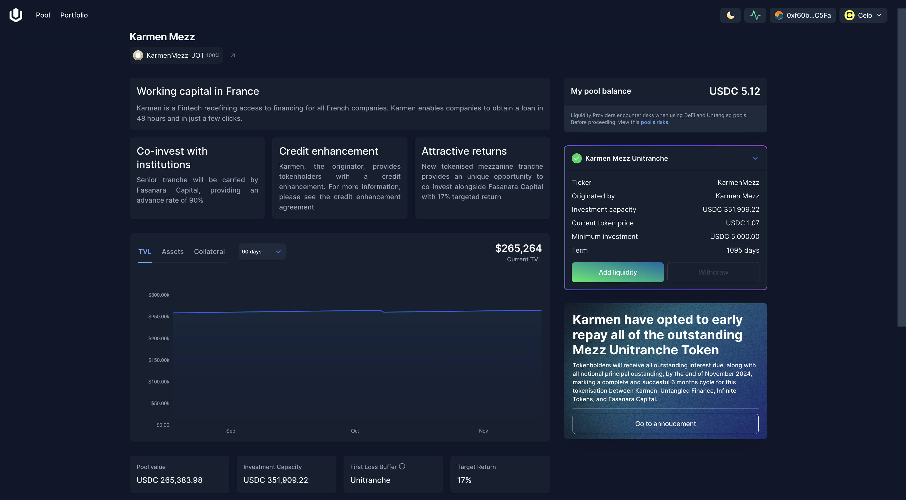
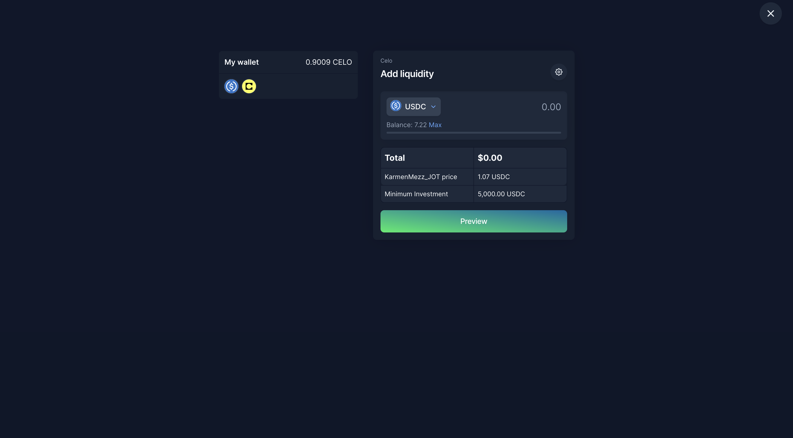
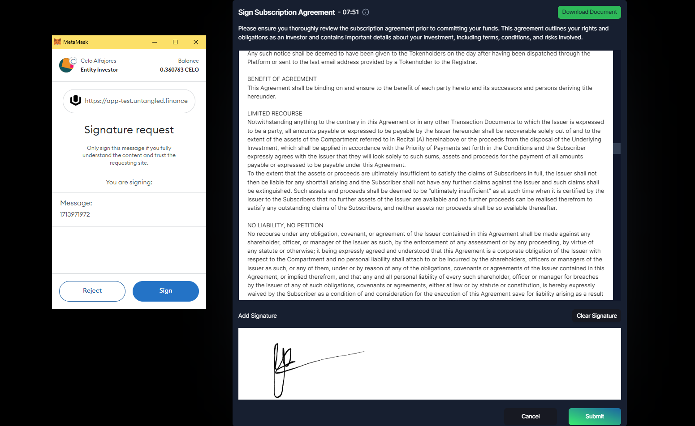
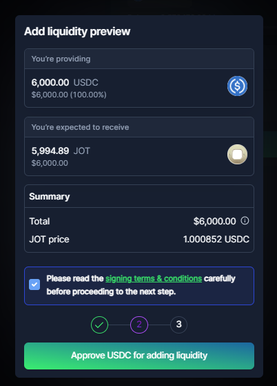
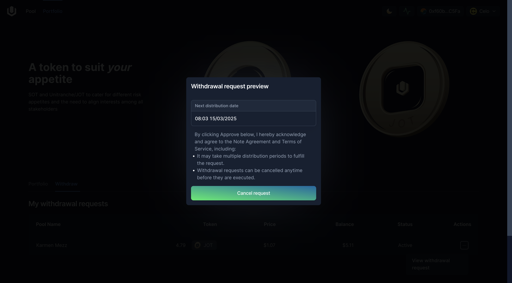

# Investor manual guides
## Explore a pool

On [Untangled Finance](https://untangled.finance) you can explore all pools currently open for investment.

Click on a pool to view its details.

:::tip
Pool collateral data is only visible to verified investors who have completed [the KYI process](./unique-identity.md#our-kyc-process).

:::

## Invest in a Pool

Please choose a pool from the list to view its details and to make investments in either SOT or JOT tokens.

### Prerequisites

- Ensure your wallet is connected and you've registered your [UID](./unique-identity) on the Investor app.
- The investment capacity for the selected pool is not already filled.
- Ensure the initial JOT investment requirement is met; note that some pools may necessitate an initial JOT investment before SOT investments are allowed.

### Investment Process

Step 1: Click on "Add Liquidity" on the JOT/SOT that you'd like to make investment.

Step 2: Enter the desired investment amount. 
The quantity of tokens you receive is contingent upon the current token price. 
Please note, SOT investment amounts are validated to ensure they comply with the [minimum first loss](./securitization-on-blockchain#minimum-first-loss) and [debt ceiling](./securitization-on-blockchain#debt-ceiling) parameter.

Step 3: Read and confirm the signing terms & conditions.

Click on the "signing terms & conditions" to read and confirm your agreement before you can move on.

Step 3: Sign the note subscription agreement.
Please read carefully and sign the note subscription agreement to continue.

:::tip
When you have already signed the note token subscription agreement, you are not required to sign the subscription when invest in the note token again, unless the agreement is updated by the Issuer.
:::

Step 4: Approve the investment amount to be transferred from your wallet by Untangled smart contract.
Please ensure you have some USDC as gas fee for the transaction.

:::tip
This step will be skipped if you have already approved the greater amount than the investement amount.
:::

Step 5: Review and confirm your investment.
Please ensure you have some USDC as gas fee for the transaction.

:::tip
Once you have invested successfully, you can import the contract address of the pool's note token and verify its balance in your wallet.
:::

## Manage Your Portfolio

### View Your Investments
View all your investments on Untangled via the Investor app's Portfolio section.

### Withdrawal Process
If you hold pool note tokens (JOT or SOT), you have the option to withdraw and reclaim your capital and earnings.

Step 1: From your Portfolio, select the investment you wish to withdraw. Alternatively, from a pool's page, click on the "Withdraw" option for pool notes.

Step 2: Enter the withdrawal amount.

Step 3: Approve and submit your withdrawal request.
The withdrawal is submitted and will be executed automatically when the [epoch](./securitization-on-blockchain#epoch) ends.

:::tip
You can make only 01 withdrawal request for each pool note token.
If you want to change the withdrawal request, please cancel the existing one and create another request.
:::

Step 4: Manage your withdrawal requests
All you withdrawal requests can be found under the tab Withdraw.

It may take several epochs until your withdrawal is fully paid, based on the pool reserve.
Unfulfilled withdrawal amount will be rolled over to the next epoch until it is fully paid, or cancelled by the Investor.

