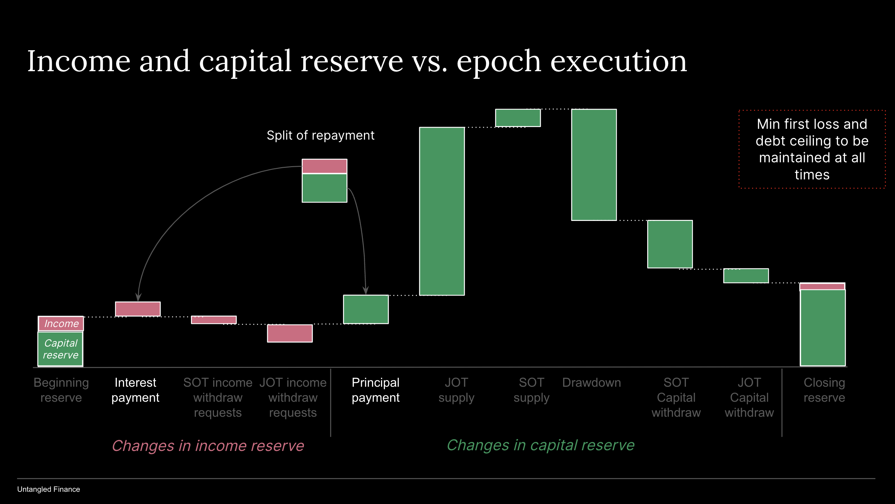
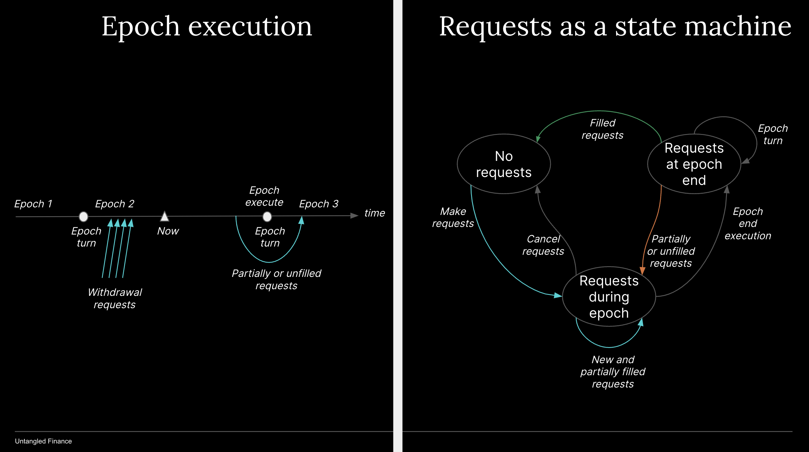

# Epoch

Withdrawal requests are queued during an epoch and executed at the epoch's end. This distribution mechanic is more equitable compared to 'first come, first serve' as RWAs are illiquid and there isn't a secondary market for tranched tokens.

Epoch is set by issuer in days and can be changed dynamically.

### Income Reserve vs. Capital reserve
To ensure that investors can always withdraw their share of a pool's income, the pool reserve is consisted of of Income Reserve and Capital Reserve. The protocol keeps track of income balance of each investor. Income reserve is not reinvested in assets but set aside to meet withdrawal requests. Capital reserve on the otherhand includes capital invested into the pool which is waiting to be deployed, repayment of principal from originators.   

So a withdrawal request is first met with the investor's income balance within the income reserve before any remaining amount to be fulfilled by capital reserve, subject to available liquidity at the epoch's end.

When the originator makes a loan repayment, the smart contract will calculate the amount that should go to the Income Reserve vs. Capital Reserve. The protocol will further calculate income belong to SOT vs. JOT holders. The system will further keep track of Income Reserve balance of each individual SOT and JOT holders 

- This epoch’s income amount belonging to SOT holders = beginning senior debt * senior interest rate during the compounding period. This amount will then be split according SOT token supply.

- This epoch’s income amount belonging to JOT holders = Total income amount - SOT holder’s income amount. This amount will then be split by JOT token supply.

- Tokenholder income balance = opening balance - income amount withdrawn + this epoch’s income amount for each holder

Later, fees/spread to Untangled, other service providers, pool’s operational expenses could be taken out of Income Reserve before distributing to JOT holders.

## Cashflow waterfall

Note that each withdrawal request can be understood to include a income part and/or capital part. The income part of the request will be met with investor's balance within the income reserve and the capital part of the request will be met with available liquidity within capital reserve. 

The distibution for withdraw requests are part of the pool's cash flow waterfall:

- At the beginning of an epoch the reserve will start out with a income balance and a capital balance

Epoch's income reserve changes

- Interest payment of a LAT repayment is added to income reserve in the manner described above.

- Income reserve is used to meet part/all of an investor's withdraw request (both SOT and JOT investors) according to the investor's income balance as calculated as above.  

Epoch's capital reserve changes

- Principal payment of a LAT repayment is added to the capital reserve in the manner described above.
  
- The capital part (if any) of an withdrawal request will be fulfilled with avalable liquidity within the reserve. Apart from principal payment, capital reserve is increased by investment from JOT and SOT investors and reduced by originator's drawdown, SOT withdrawal and JOT withdrawal, in this order of execution. 
  
## Epoch execution

Withdrawal requests are sent to the pool during the epoch duration, tranched tokens are locked/approved. 

At epoch end, withdrawal requests will be fulfilled as follows:

- From the tokenholder's balance within the Income Reserve. The protocol calculates income reserve and split it into balances of SOT vs. JOT holders.  
- Any remaining amount: fulfilled by Capital Reserve where requests are met on a pro-rata basis according to the existing implementation. 
- Any unmet requests will be transferred to the next epoch.
- At the next epoch’s end, the process above will continue. Token holders can cancel request at any time.

## Worked example

### Inputs

Pool has 4 token holders with the following share: A: 100,000 B: 200,000 C: 300,000 D: 400,000 -> token supply = 1,000,000  

- Reserve = 0

- NAV = $1,000,000 (token price = $1)

- Epoch period = 1 month

- During the epoch: B and C request to withdraw $10,000 and $20,000 respectively

At end of month 1: Originator repay $30,000 of which interest repayment is $10,000 and principal repayment is $20,000

### At Epoch end

#### Calculate Income Reserve allocation

- A: $1,000 B: $2,000 C: $3,000 D: $4,000 -> total allocation = $10,000. 

- B and C withdraw requests are partially filled with their Income Reserve balance 

#### Calculate the remaining distribution:

Remaining requested amount

- B: request $10,000 and got $2,000 through income reserve balance -> the remaining amount = $8,000

- C: request $20,000 and got $3,000 through income reserve balance -> the remaining amount = $17,000

Total remaining amount = $8,000 + $17,000 = $25,000

#### Calculate and execute withdrawal amount from Capital Reserve:

Amount going to Capital Reserve = Principal amount paid by originator = $20,000. Remaining amount requested to withdraw = $25,000 

This means only 80% of the remaining requests will be met: B = $8,000 x 80% = $6,400; C = $17,000x80% = $13,600   

#### Calculate withdrawal requests to move to next epoch 
A: $0

B: $10,000 - $2,000 - $6,400 = $1,600

C: $20,000 - $3,000 - $13,600 = = $3,400

D: $0  
