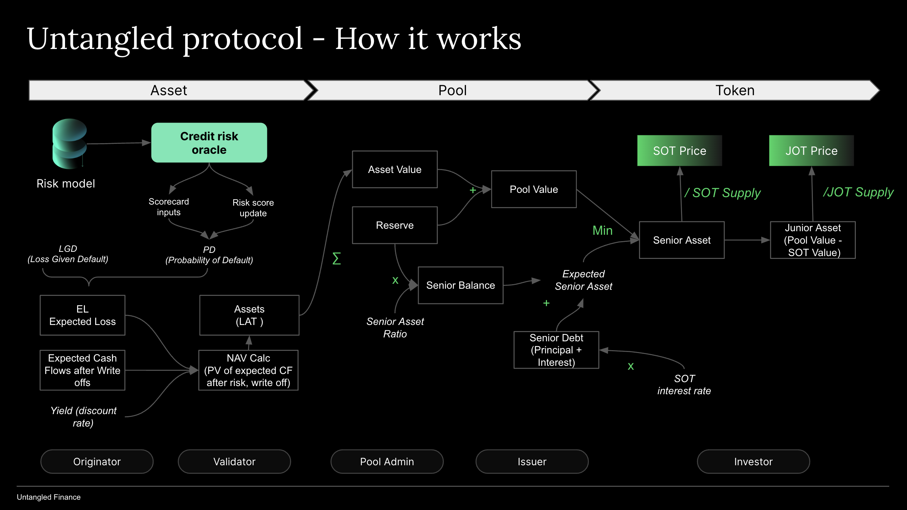

# How it works
Here we summarize how Untangled protocol works.

## Participants 

### Investor 
are credit investors who are looking for yields (fixed or variable). Only investors passing KYC/accreditation can invest and redeem (can mint a unique identity token - UID). Individuals/businesses provide liquidity to a “strategy” i.e. individual asset pools or a diversified pool. 

### Pool admin
is a role that is able to create new pools and set parameters such as first-loss buffer (min first loss), borrow cap (debt ceiling), risk scorecard. Pool admin is appointed by governance.

### Issuer 
is a permissioned party who, as the pool owner, issues tranched tokens to credit investors in exchange for stable coins. Issuer acquires collaterals from approved originators. Issuer also operates ‘pool wallet”, an externally-owned account or a smart contract wallet (such as Safe) that they link to the pool to manage pool reserve (avoiding commingling of funds with their own or with other pools).

### Originator 
are those authorized to sell/pledge collaterals to the pool by Issuer. They may also be responsible for servicing the collaterals (collect and repay) and may retain risk through subscribing to a junior tranche (represented by JOT).

### Validator 
a trusted entity that provides validation services re collaterals: e.g. performing due diligence on collaterals being locked into a Pool such as loans, invoices or carbon credits.

## Pool 

A set of smart contract instances that facilitates interaction between the borrowing side and lending side. 

Borrow pools hold collaterals for financings (Loan Asset Tokens or LATs) and automatically enforce rules such as minimum first loss, borrow limit (debt ceiling). The smart contracts also issue SOT/JOT for new investment by credit investors and calculate net asset value (NAV) and token prices.

Pool can have up to two pool tokens:

### JOT
Junior Obligation Token represents the junior tranche (or unitranche if the pool issues only one token) in a pool. JOT token holders earn a variable return based on residual cash flow in a pool. A pool needs to maintain a minimum JOT amount as a minimum first loss (or first loss buffer).

### SOT
or Senior Obligation Token represents the senior tranche in a pool. SOT token holders earn a fixed interest rate through the increase in SOT token prices (interest accruals)
- There is no duration for pool tokens, i.e., perpetual - as long as investors keep money in the pool they will earn a return from the pool’s financings. Investment periods could however be enforced through off-chain agreements.

### Reserve 

the value of stablecoins in a Pool.

### Assets

Originators lock up collaterals (in a SPV) and ‘drawdown' based on a risk scorecard. A financing token (LAT - Loan Asset Token) is minted for each collateral. From this time onwards each LAT has a risk core based on the performance of the underlying collateral backing it up. The financings, LATs, form the assets of the pool

Valuation of assets (Net Asset Value Calculation) is based on the Discounted Cash Flow (DCF) method. DCF is used because there are no active secondary markets for loan financings (LATs).

### Pool Value 
equals Reserve plus Net Asset Value.

### Minimum First Loss 
a Pool’s parameter that reflects minimum currency amount of JOT over Pool Value.

