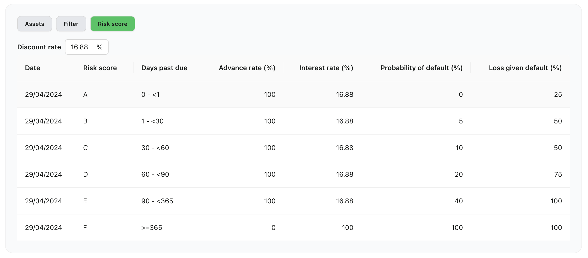

# Asset valuation

When originator drawdown a financing token (LAT) is minted to the pool. Each LAT corresponds to each financing and is backed by locked collaterals (collateral assets are segregated in an SPV). Any permissioned user can call to repay a loan financing using its ID. The repayment amount will be routed to the Pool. Once a loan financing is fully repaid the financing LAT will be burned and the locked collaterals returned to originator (off-chain).

Asset value of a pool is the sum of the value of all LATs outstanding in that pool. Asset Valuation is the process of determining the current worth of an asset or portfolio by assigning a monetary value. The value of a portfolio of assets is often also expressed as the net asset value (NAV).

A NAV is usually required when a portfolio is sold or when investors want to join/exit an existing pool. Then the portfolio value ultimately determines the investment/redemption price. Note that for these purposes the portfolio value may be different to the book value or accounting value of a portfolio.

Net Asset Value Calculation is based on the Discounted Cash Flow (DCF) method. DCF is used because there are no active secondary markets for loan financings (LAT). Each loan financing (LAT) has a risk core based on the performance of the underlying collateral backing it up. Each risk score corresponds to a Probability of Default and Loss Given Default for the assets in question. 

## Mechanics of NAV calculation based by DCF method

### Derive Expected Cash flows 
For every outstanding financing (LAT) of collateral, the expected cash flow is calculated. The current implementation allows to calculate the Expected Repayment of simple bullet loan structures which are common in invoice financing and trade finance. The Expected Cash Flow is calculated based on (i) the expected repayment dates and (ii) the expected repayment amounts. (i) The expected repayment date is derived on contractual obligations associated with the financing, e.g. the due date of the underlying collateral. This is provided through an API call for each NFT minted. (ii) The expected repayment amount is projected based on the outstanding financings by applying the interest rate on the LAT on the current debt until the repayment date.

### Work out Risk-adjusted Expected Cash Flows 
The Expected Cash Flow is risk-adjusted for credit risk by the Expected loss. Every financing is allocated a risk class that has a Probability of Default (PD) and Loss Given Default (LGD) assigned to it. 

The Expected Loss is calculated as Expected Loss (EL) is calculated: $$\text{Expected Loss} = \text{Probability of Default} * \text{Loss Given Default} * \text{Exposure At Default}$$ and subtracted from the expected repayment amount to adjust for credit risk. Note that PDs are often communicated per annum and may need to be adjusted to the term of the underlying collaterals. 

$$\text{Expected Cash Flow} = \text{Cash Flows from financings} - \text{Expected Loss}$$ 

Write-offs are a special case where the PD and LGD of a particular asset are both 100%. Therefore, Expected Cash Flow of that asset is zero.

### Calculate NAV
Discount risk-adjusted expected cash flows: The risk-adjusted expected cash-flows are discounted with an appropriate discount rate (this depends on asset class and pool) to derive the present value of a financing. The discount rate usually reflects the rate of return an investor could earn in the marketplace on an investment of comparable size, tenor and risk. Note that the discount rate is the same for every financing of a pool. The standard formula to calculate the PV of a cash flow is

$$
\text{Present Value} = \frac{\text{Expected Cashflow}}{(\text{1} + \text{r})^\text{t}}
$$

where r = `discount rate` and t = `period of cash flows`

Adding up the present values of the risk-adjusted expected cash flows for all financings in the pool leads to the (portfolio) NAV. The NAV plus the liquidity currently in the Reserve of the Pool gives the Pool Value.​

# Credit oracle

## Risk scorecard
The risk scorecard will be used for on-going Net Asset Value Calculation (NAV Calc). 

