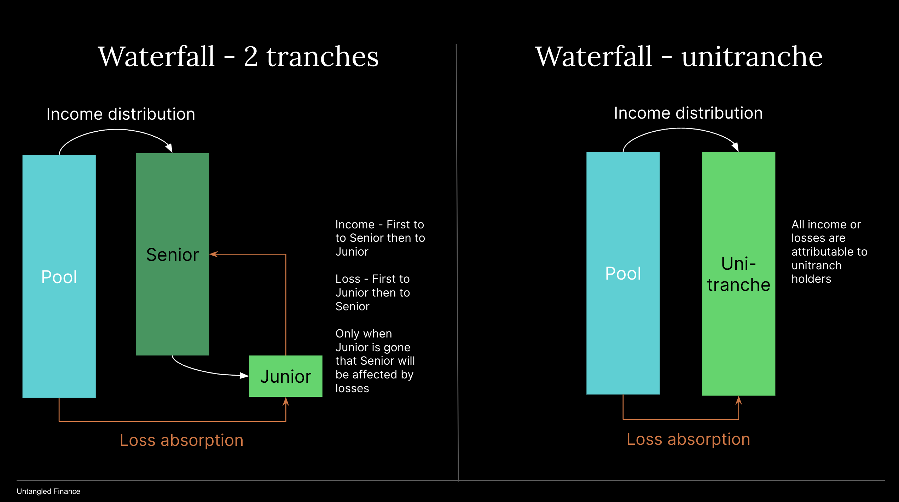

# Pool tranche tokens
Each pool can have up to two pool tokens:

- JOT or Junior Obligation Token represents the junior tranche (or unitranche if the pool issues only one token) in a pool. JOT token holders earn a variable return based on residual cash flow in a pool. A pool needs to maintain a minimum JOT amount as a minimum first loss (or first loss buffer).

- SOT or Senior Obligation Token represents the senior tranche in a pool. SOT token holders earn a fixed interest rate through the increase in SOT token prices (interest accruals)

There is no duration for pool tokens, i.e., perpetual - as long as investors keep money in the pool they will earn a return from the pool’s financings. Investment periods could however be enforced through off-chain agreements.

## SOT
Credit investors who add liquidity into a pool receive a pool-specific ERC-20 token. SOT token accrues interest at the determined interest rate, but is affected by the pool reserve’s utilization (referred to as ‘cash drag’ in TradFi) and performance of the underlying collaterals (which drives Net Asset Value calculation).   

Accrued interest is not added to the SOT balance but its currency amount through an exchange rate (SOT price). Refer to sections below for details on SOT pricing and NAV calc.

## JOT
JOT is the first loss capital in a specific pool. First loss capital is a safety measure that offers more protection to SOT holders in the event of a Default. First loss capital can be supplied by anyone but the Pool Admin can stipulate a minimum JOT amount to be supplied by the Originator to ensure interest alignment.

A pool might have a single token JOT (first loss ratio is 100%). This is also referred to as unitranche pool/unitranche token. All token holders in the pool receive a pro rata share of the pool value in case of default. 

## Cash flow waterfall

### Tranched pool
Tranched pools consists of both SOT and JOT tokens. Income from the tranched pool asset will first be accrued to SOT holders at a fixed rate. Any remaining income will go towards JOT investors. If a pool suffers losses from its assets the losses will first be absorbed by JOT tranche before SOT tranche being affected. This is referred to as `cash flow waterfall`, a proven structure in TradFi.

### Unitranche pool
In a unitranche pool, the entire income or losses of the pool's assets is shared among JOT tokenholders. A unitranche pool (only has JOT) does not automatically mean it's a junior pool. If a pool accepts tokenized senior tranche in a securitization structure as collateral and itself issues a unitranche token, that unitranche token effectively repreferents fractional interests in the senior tranche. Therefore, it is in effect a senior token.

