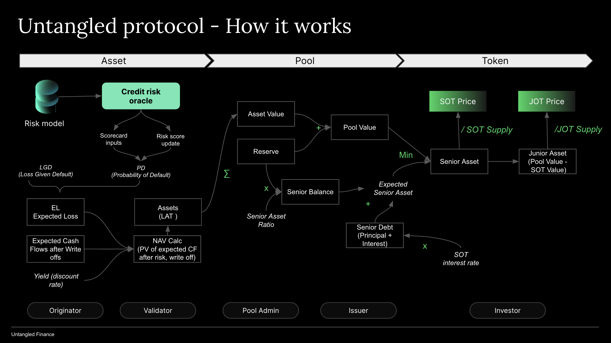

# From NAV to token price

When a pool is just launched, tranche tokens SOT and JOT start at a price of \$1. When investors supply liquidity, they will receive SOT or JOT tokens minted, and their stablecoins will be deposited into the pool's capital reserve. If the capital is not deployed, no income will be accrued, and the token price will remain at $1. Thus, investors will not earn anything, a situation referred to as "cash drag."

When reserves are deployed in yield-generating assets, the token price will begin to increase. SOT prices will rise according to a fixed rate, based on the extent to which senior investments are deployed. JOT price will increase according to their share of asset yield and any difference between asset yields and SOT interest, or "excess spread."

If assets underperform, their value (NAV) will decrease, impacting the value of JOT tokens first. When the value of JOT tokens reaches zero, the value of SOT tokens will begin to decrease, directly leading to a reduction in SOT prices.

Pool value is the sum of asset value (NAV) and reserve. Pool value is also the value of senior tranche tokens (SOT value or Senior Asset) and junior tranche token (JOT value or Junior Asset). Obviously, if a pool only has only one tranche (unitranche) then the entire pool value is attributable to JOT value.

$$poolValue = NAV + Reserve = \text{seniorAsset} + \text{juniorAsset}$$

The chart above sets out the dynamics of NAVs to token prices in detail. For further insight into the NAV calculation methodology, please refer to the NAV Calculations section. The following sections will explain the SOT and JOT price calculations.

# Pricing of SOT

Senior Asset: seniorAsset is the amount which belongs to the senior tranche investors in a pool. It comprises of Senior Debt and Senior Balance.

$$\text{seniorAsset} = min(\text{expectedSeniorAsset},\text{poolValue})$$

In which: $$expectedSeniorAsset = seniorDebt + seniorBalance$$

- Senior Debt is the amount which accrues interest for the senior tranche.

$$ seniorDebt = \text{beginning senior debt} \* (1 + \frac{\text{SOT interest rate}}{\text{n}})^n$$

- Senior Balance is the amount of the senior tranche which is not used for earning interest (cash drag). It is part of Reserve that belongs to SOT investor.

$$seniorBalance = Reserve * seniorAssetRatio $$

$$ seniorAssetRatio = \frac{seniorAsset}{reserve} $$

$$\text{SOT price} = \frac{\text{seniorAsset}}{\text{SOT supply}}$$

# Pricing of JOT

Junior Asset is the amount which belongs to the junior tranche investors in a pool. If a pool has just a singple tranche (unitranche) then Junior Asset is the same as Pool Value.

$$juniorAsset = poolValue - seniorAsset$$

$$\text{JOT price} = \frac{\text{juniorAsset}}{\text{JOT supply}}$$

If loans are defaulting, the juniorAsset would cover the losses. If the entire juniorAsset is lost, the poolValue could be lower than the expectedSeniorAsset, thus reducing the SOT price.
