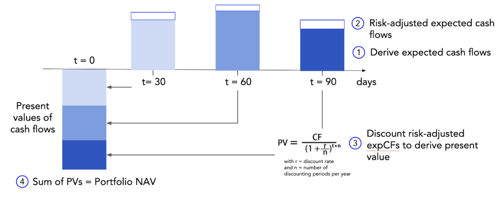

# Securitization on blockchain

Securitization in the financial market involves bundling financial assets, like loans, into tradable securities, typically bonds, to enhance liquidity. These securities represent a claim on the cash flows generated by the underlying assets, allowing investors to buy and sell them on secondary markets. 
To bring this concept to blockchain, each real-world asset is tokenized into a Non-Fungible Token (NFT) which represents the asset on blockchain. The NFT is evaluated. The asset originator can use it as a collateral asset to borrow from a Lending pool, and then repay the principal and interest accrued over time.
Investors who provide liquidity to the pool hold the pool note tokens, which has the APY accumulated in their price. Investors can withdraw their investment from the pool when the debt is repaid and get the profit.

## Key terms
### Lending pool (or pool)
Untangled lending pools are written as smart contracts on blockchain and they operate the same way how traditional securitization pools work, but they also have differences:
Tokenized assets provide transparency to the investors. They can track the financial transactions on chain and see what assets are pledged for financing, how much has been financed and how much repaid, which assets are repaid in due and which overdue.
The pool life cycle is not fixed. Investors can invest any time as long as the note sale is open and capacity not reached and originators can get financed any time as long as the liquidity is available. 
### Tranches
Investors can choose to invest in either senior or junior tranches based on your risk tolerance and return objectives. Senior tranches are for those seeking stable income streams with lower risk, while junior tranches are for those willing to accept higher risk in exchange for potentially higher returns.

- **SOT** or **Senior Obligation Token** represent the senior tranche in the pool. SOT token holders earn a fixed interest rate through the increase in SOT token prices (interest accruals)
- **JOT** or **Junior Obligation Token** represent the junior tranche (or unitranche) in the pool. JOT token holders earn a variable interest based on residual cash flow in a pool. A pool needs to maintain a minimum JOT amount as a minimum first loss.

SOT holders are prioritized for payment on withdrawal.
There is no duration for pool tokens, i.e., perpetual - as long as investors keep money in the pool they will earn interest from the underlying assets. Investment periods are however enforceable through off chain agreements.

### Issuer
Pool issuer refers to the entity responsible for creating and managing the pool of financial assets that will be securitized. In traditional finance, this issuer can be a financial institution, such as a bank or a special purpose vehicle (SPV) specifically established for the purpose of securitization. Things are similar on-chain as the issuer will be the entity to launch sale of note and define the pool note and asset configurations, which will be updated on chain to operate the pool.

### Asset Originator (or Originator)
Originator is the entity responsible for initially creating or acquiring the financial assets that will be securitized. This entity can be a bank, financial institution, or any organization that originates or holds the underlying assets, such as mortgages, auto loans, or credit card receivables. The asset originator may also be the same entity as the pool issuer or may work in conjunction with it. The role of the asset originator is to identify, underwrite, and package the assets into a pool that will serve as collateral for the securitization process. By transferring these assets into the pool, the asset originator pledges the asset as collateral and gets financed, based on the asset pricing. This allows the originator to free up capital and reduce exposure to the risks associated with holding these assets on its balance sheet.

### Asset Validator (or Validator)
Validator is an entity responsible for verifying the quality and authenticity of the assets included in the securitization pool. This validator plays a crucial role in ensuring that the assets meet the required standards and criteria set forth for tokenization. The pool contracts require Validator signature on-chain to mint the pool assets as Loan Assets Tokens (LAT).

### Liquidity provider (or Investor)
Liquid providers or Investor are those who provide liquidity to the pool. Investor can invest in senior or junior tranche, depending on how they structure their portfolio. While SOT can have limited sale time if SOT sale is Dutch auction, JOT is open for sale until the investment capacity is fulfilled.

### Minimum first loss
A pool parameter that reflects minimum currrency amount of JOT over Pool value.
Minimum first loss is the parameter to protect SOT investors in the event of liquidity withdrawal.
Once the first loss is equal to or less than Minumum first loss, Investors cannot invest in SOT or withdraw JOT.
The more risky the pool assets get, the higher minimum first loss should be set to prevent JOT investors from withdrawal.

### Debt ceiling
Debt ceiling is the parameter set and can be updated by Pool Admin, reflecting the maximum amount of pool investments allowed, including JOT and SOT.
:::tip
If the Pool Admin needs to stop a pool from selling notes, he can set the debt ceiling to a small number. Investors can no longer bid for JOT/SOT, regardless of the available investment capacity.
:::

## Protocol mechanics
### Tokenized RWA
#### Risk scorecard
The risk scorecard serves as a tool for evaluating and quantifying the risk associated with loan assets, particularly in terms of default probability. Within the framework of Untangled Protocol, this risk scorecard is developed through a data model aimed at predicting the likelihood of default and potential loss for loans. Consequently, it serves as a pivotal component for the valuation of asset portfolios.
Each lending pool is equipped with a singular risk scorecard, which serves as the basis for classifying loan assets according to their respective "days past due" metrics. The determination of an asset's score occurs at the point of collateral pledging by the Originator for the loan. Subsequently, all calculations regarding the asset's value for the loan are contingent upon its assigned risk score.
For every risk score, a distinct set of valuation parameters is employed to determine the financing amount, interest rate, and asset value. These parameters typically include the advance rate, interest rate, discount rate, probability of default, and loss given default.
The configuration of the risk scorecard falls under the purview of the Pool Admin and may be subject to occasional updates by the said administrator, albeit infrequently and typically in response to significant financial events.
#### Asset valuation
Asset Valuation is the process of determining the current worth of an asset or portfolio by assigning a monetary value. The value of a portfolio of assets is often also expressed as the net asset value (NAV).
An NAV is usually required when a portfolio is sold or when investors want to join/exit an existing pool. Then the portfolio value ultimately determines the investment/redemption price. Note that for these purposes the portfolio value may be different to the book value or accounting value of a portfolio.
Determining the value of illiquid assets is difficult because – by definition – there isn’t a liquid secondary market to determine the value, unlike many stocks, bonds or most fungible tokens. For illiquid asset portfolios the valuation methodology is thus often based on a fair value valuation utilizing a financial model. This often comes down to valuing the present value of future cash flows expected to receive based on these financings under discounted cash flow (“DCF”) method.

- **Derive Expected Cash flows**: For every outstanding financing (LAT) of collateral, the expected cash flow is calculated. The current implementation allows to calculate the Expected Repayment of simple bullet loan structures which are common in invoice financing and trade finance. The Expected Cash Flow is calculated based on (i) the expected repayment dates and (ii) the expected repayment amounts. (i) The expected repayment date is derived on contractual obligations associated with the financing, e.g. the due date of the underlying collateral. This is provided through an API call (oracle) for each NFT minted. (ii) The expected repayment amount is projected based on the outstanding financings by applying the financing fee (interest rate on the LAT) on the current debt until the repayment date.
- **Risk-adjusted expected cash flows**: The expected Cash Flow is risk-adjusted for credit risk by the Expected loss. Every financing is allocated a risk class that has a Probability of Default (PD) and Loss Given Default (LGD) assigned to it. The Expected Loss is calculated as Expected loss = Expected Cash Flow * PD * LGD and subtracted from the expected repayment amount to adjust for credit risk. Note that PDs are often communicated per annum and may need to be adjusted to the term of the underlying collaterals..
- **Discount risk-adjusted expected cash flows**: The risk-adjusted expected cash-flows are discounted with an appropriate discount rate (this depends on asset class and pool) to derive the present value of a financing. The discount rate usually reflects the rate of return an investor could earn in the marketplace on an investment of comparable size, tenor and risk. Note that the discount rate is the same for every financing of a pool. The standard formula to calculate the PV of a cash flow is

        PV=CF/(1+r)tPV=CF/(1+r)t

with r = discount rate and t = period of cash flows. As we deal with intra-year cash flows, the formula becomes

- **Calculate NAV**: Adding up the present values of the risk-adjusted expected cash flows for all financings in the pool leads to the (portfolio) NAV. The NAV plus the liquidity currently in the Reserve of the Pool gives the Pool Value.​
- **Operational costs**
Average loan maintenance/running costs (such as legal, SPV, servicing) could be subtracted from the PV. 
#### Liquidation via collateral auction
This is a liquidation where all collaterals in the pool will be auctioned off to repay investors. The pool status will be set such that it: 
- is unable to accept new investment subscriptions 
- is unable to lock new collaterals in order to further drawdown from the pool reserve 
- uses the pool reserve to redeem SOT investors 
- returns any remaining amount to JOT investor 
The collateral auction starts with minting a single NFT to represent the all collaterals in the pool. It follows an English auction where the highest bidder wins.
If the auction fails, pool issuer/admin can pursue recovery off-chain such as through a back-up servicer or debt collection services. Given that the collaterals are hived off to a separate legal entity in the real world, this process is similar to how TraFi deals with securitisation defaults.

### JOT & SOT pricing
As loan assets in the pool are revolving, it also continuously receives subscriptions and makes redemption to Investors. In the absence of a secondary market for SOT and JOT, their pricing has to be determined by the Protocol, based on such factors as NAV. The Protocol will quote the price of SOT and JOT on a live basis to allow investors to subscribe or to redeem. 

**SeniorAsset**: The seniorAsset is the amount which belongs to the senior investor (SOT) in a pool.
- seniorAsset=min(expectedSeniorAsset,poolValue)
- Expected SeniorAsset=seniorDebt + seniorBalance

**SeniorDebt**: SeniorDebt is the amount which accrues interest for the senior tranche.
- seniorDebt = beginningSeniorDebt(1+seniorInterestRate/n)^n (n is compounding period in a year)

**SeniorBalance**: SeniorBalance is the amount of the seniorTranche which is not used for interest accumulation.
- seniorBalance = reserve * seniorAssetRatio

**Pool Value**: poolValue = NAV + Reserve = SOT Value + JOT Value
- SOT price = seniorAsset/SOT supply 

**Junior Asset**: juniorAsset = poolValue - seniorAsset
- JOT price = juniorAsset/JOT supply

If loans are defaulting, the juniorAsset would cover the losses. In other words, when Assets are not performing, NAV will decline which will first wipe out the junior tranche (therefore it is called the first-loss tranche) before the senior tranche is being affected. If the entire juniorAsset is loss, the poolValue could be lower than the expectedSeniorAsset.

### Epoch

To ensure the fairness between all users during the withdraw process, a new term called **Epoch** is introduced. For Untangled V1 pool, all of withdrawal requests are committed over a specified period known as an "Epoch". These transactions are securely locked in during this timeframe and are automatically executed at the end of the Epoch. This structured approach ensures the management of funds while maintaining stability and consistency in withdrawal processes. Repayments and investments may occur at any point during the epoch, yet they are gathered in a distinct reserve. These funds are exclusively earmarked for financings in the subsequent epoch, ensuring that investors have priority for their withdrawal. The length of the epoch is flexible but currently Untangled V1 pools are applying 1 month epoch. 

During an Epoch, withdrawal requests will be queued and processed in batches, drawing from a predetermined portion of the pool's liquidity to ensure equitable distribution among investors. There are two types of withdrawal you can make in this period: income withdraw and capital withdraw. "Income" is the term for the profit investors made from the repayment of the Originator. Capital withdraw is the withdrawal of the initial investment that investors made. During the commitment period, if investors withdraw their capital, then they will be charge a flat fee base on the amount of capital they withdraw. The income withdraw requests are always 100% fulfilled in every epoch. Meanwhile, the capital withdraw fulfillment is based on the available capital reserve in the pool and equally distributed among withdraw requests. The unfulfilled capital withdrawal within an epoch will be automatically queue for the next epoch. 

The fund for the withdraw order will be draw from investor's income balance and capital balance. If the value of the order is smaller than the income balance, then it would only withdraw the fund from the income balance. Otherwise, the order will use the capital balance to fulfill the remainder amount of the request after used all of the income balance. 

Investors retain the option to cancel their withdrawal requests at any point, albeit potentially incurring a cancellation fee. After the epoch is executed, the currency will be automatically transfered to investor's wallet.

The following example will provide a better understanding of the epoch execution:

Suppose that there is a pool X with epoch length of 1 month and epoch execution date is at 30th every month. The fee percentage for the early capital withdraw is 2%. 

At day 10 of month n, investor A have accrued an income amount of 1,000$ from the Originator repayment earlier that month and he placed an 7,000$ withdraw order. At that moment, investor A expected to withdraw 1,000$ from his income balance and 6,000$ from his capital balance. So the expected fee amount = 6,000% * 2% = 120$ . However, after that, the Originator made some more repayment so investor A's income balance increases to 2,000$ by the 30th of that month. When the epoch is executed, the actual execution will withdraw 2,000$ from his income balance and 5,000$ from his capital balance. Suppose that the capital reserve is more than 5,000$ and there only 1 capital withdraw order in that epoch, so his capital withdraw order is 100% fulfilled. Hence, he will be charge an amount = 5,000$ * 2% = 100$ . So in total, investor A will receive 6,900$. 

