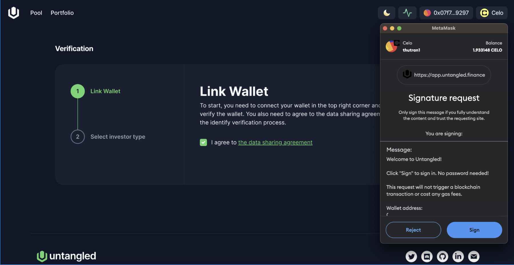
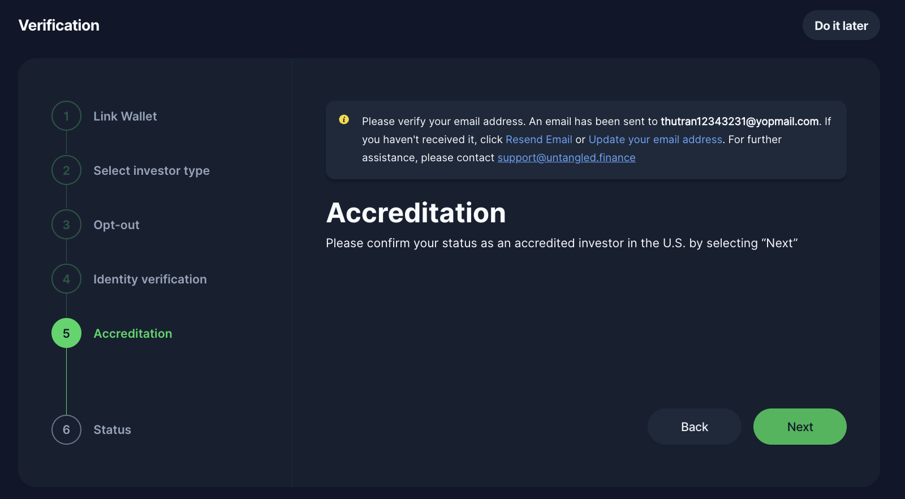
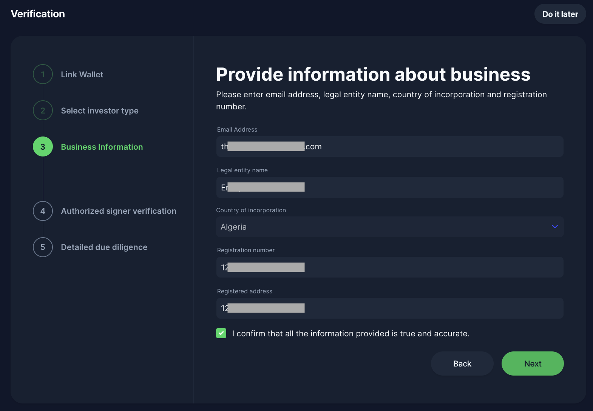
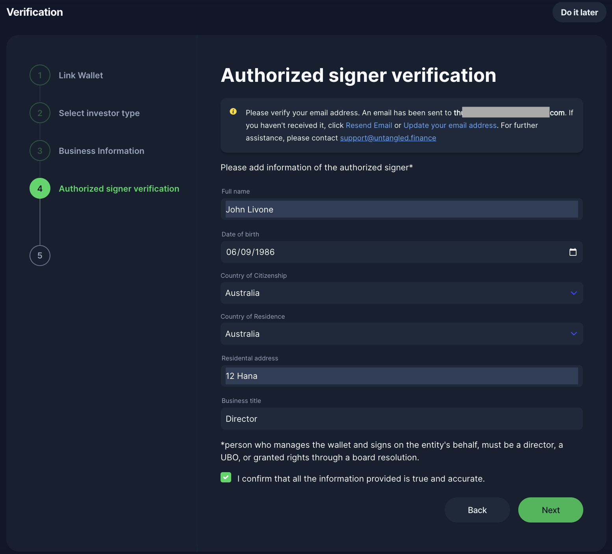

# Unique Identity

## What is UID?
To ensure the integrity of our protocol remains uncompromised, it is mandatory for all users to undergo our Know Your Customer (KYC) verification process. This crucial step not only confirms your identity but also grants you the privilege to mint a distinctive Non-Fungible Token (NFT), referred to as a Unique Identity (UID). 
Your UID is an ERC-1155 NFT, a key that enables you to participate in the Untangled lending protocol. This digital asset serves as your verified identity within our ecosystem.
### Our KYC Process
The KYC verification is conducted through our trusted identity verification partner, Shuftipro (https://shuftipro.com)  ensuring a seamless and secure process. Importantly, no personal information is stored on-chain, maintaining your privacy and security.
### KYC Requirements for Different Investor Types
Investment opportunities on the Untangled Protocol are open to accredited investors and entities only. For legal and compliance reasons, we have tailored the KYC requirements to accommodate four distinct types of investors:
1. Non-US individual
2. Non-US entity
3. US individual
4. US entity

## Onboarding

To start using the Untangled Investor App, follow these simple steps:
- Go to https://app.untangled.finance.
- Click the "Connect Wallet" button located at the top right corner.
- Select your preferred wallet service from MetaMask, WalletConnect, or Coinbase Wallet. This will be the wallet you use for transactions and investments on Untangled.
:::note
Remember, you can switch your connected wallet anytime. However, each new wallet address requires a separate KYC verification.
:::

### Individual Onboarding Flow 
**Step 1 Link wallet**

Please sign with your wallet address to continue.

**Step 2 Select investor type**

**Step 3 Identity verification**

The personal information you submit will undergo verification by Shuftipro once you click "Next." It's important to provide accurate information that matches the details on your National ID card, Driving License, or Passport. This step is a vital part of our KYC verification process, ensuring the accuracy and security of your identity verification.

You can also scan the QR code to do the verification on the other device.

After successfully verifying your identity, close the popup window to return to the Untangled interface.

:::note
You must verify your email address to continue with Self-certification or Accreditation
:::

**Step 4 Self certification (non-US individual investors)**

Investment opportunities within the Untangled Protocol are exclusively available to accredited or professional investors. By choosing your investor category, you affirm that you meet these qualifications. Should you have any doubts regarding your eligibility, we strongly advise consulting with financial or legal advisors in your area. This step is part of our KYC verification process to ensure compliance and suitability for our investment offerings.

:::note
You must verify your email address to complete this step. 
:::

**Step 4 Accreditation  (US individual investors)**

Investors holding US citizenship are required to undergo a manual accreditation verification process as part of our KYC procedures. This involves the submission of pertinent documents for manual review by the KYC team, ensuring compliance and eligibility for investment on our platform.

Depending on the options selected, you will be required to upload supporting documentation to verify your choices.

- **A recent credit report**, if you are Individual with income exceeding $200,000 in each of the two most recent calendar years or joint income with a spouse or spousal equivalent exceeding $300,000 for those years and a reasonable expectation of the same income level in the current year
- **IRS Forms such as W-2s, 1040s, 1099s, K-1s or other tax documentation that report income (for the past two years)**, if you are an individual with a net worth or joint net worth with a spouse or spousal equivalent of at least $1 million, not including value of the primary residence
- **A document issued in the recent three months confirming your positions**, if you are a director, executive officer, or general partner of the company selling the securities, or any director, executive, or general partner of a general partner of that company.
- **The CRD number** if you are an individual holding in good standing any of the general securities representative license (Series 7), the investment representative license (Series 65), or the private securities offerings representative license (Series 82).

After you submit your documents, our KYC team will conduct a manual review. Should your documents fail to meet our requirements or if further information is needed, we will contact you via your verified email address. In these instances, we may ask for additional or corrected documentation to proceed with the verification process.

**Step 5 Status**

Once approved, you will be able to generate the Identity Passport, which will allow you to access a wide range of investment opportunities on the protocol.  

### Entity Onboarding Flow

**Step 1 Link Wallet**
**Step 2 Select investor type**
**Step 3 Business information**

**Step 4 Confirm ultimate beneficial owners**
Ultimate Beneficial Owners (UBOs) are individuals or entities that ultimately own or control a customer or entity, typically through direct or indirect ownership of a significant percentage of the shares or voting rights. This can also include those who benefit from the entity or have the ultimate control over the management and operations. In most jurisdictions, the threshold for significant ownership is often set at 25% or more of the shares or voting rights, but this can vary.

**Step 5 Authorized signer verification**
 
Please provide personal information of the entity’s authorized signer (the person who controls the wallet).

The authorized signer is required to undergo identity verification following the same procedure outlined in the Individual Investor Onboarding.

The personal information you submit will undergo verification by Shuftipro once you click "Next." It's important to provide accurate information that matches the details on your National ID card, Driving License, or Passport. This step is a vital part of our KYC verification process, ensuring the accuracy and security of your identity verification.

You can also scan the QR code to do the verification on the other device.

After successfully verifying your identity, close the popup window to return to the Untangled interface.

**Step 6 Corporate documentation**

At this stage, you must submit your corporate documents for a manual review conducted by the KYC team.

:::note
You must verify your email address to continue
:::

**Accreditation (For US entity only)**
Select entity accreditation category

Depending on the options selected, you will be required to upload supporting documentation to verify your choices.

**Step 7 Status**

The review of your corporate documents by the KYC team may take up to a few hours to a couple of days. If the submitted documents do not meet the requirements, we will contact you via your verified email address to request further or corrected information or documents. 

Once approved, you will be able to generate the Identity Passport, which will allow you to access a wide range of investment opportunities on the protocol.  

## Generate Identity Passport
As an Individual or Entity investor, if you're seeing this screen, congratulations! You're verified and can now mint your UID at no extra charge from Untangled. Remember, while minting is free, you'll need to cover a small amount of the network’s gas fee, so ensure you have enough CELO/USDC  in your wallet for the transaction.

Once your UID is minted, you can now explore pools and make your first investment!

