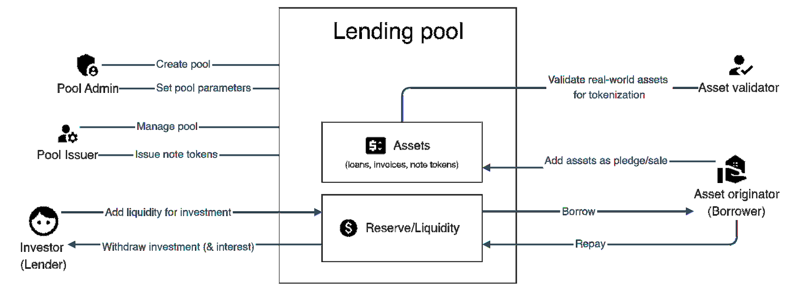

# User roles and permission

Except for Investors who interact with Untangled protocol from Investor app, all the other roles work on Untangled Issuer app.

| Protocol Admin                                              | Pool Admin                                                                                                                      | Issuer                                                                                                                                                                                                                           | Originator                                                                                                                                                                       | Validator                                                                                  |
|-------------------------------------------------------------|---------------------------------------------------------------------------------------------------------------------------------|----------------------------------------------------------------------------------------------------------------------------------------------------------------------------------------------------------------------------------|----------------------------------------------------------------------------------------------------------------------------------------------------------------------------------|--------------------------------------------------------------------------------------------|
| 1. Deploy and upgrade contracts 2. Pause/ unpause contracts | 1. Create pool 2. Designate pool issuer 3. Designate pool validator 4. Set/Update pool parameters 5. Set/update risk score card | 1. Designate pool originator 2. Generate/ update docs and templates 3. Populate pool information and notifications 4. Issue/update notes 5. Operate pool reserve (approve allowance) 6. Invest in other pools (Pool2Pool invest) | 1. View collaterals and all functions to do with collaterals 2. Upload/ update collaterals 3. Mint LAT for financing and drawdown 4. Collect collateral and repay the Asset Pool | 1. View assets to be validated 2. Sign message to validate each asset or a batch of assets |

## Sign up
On Issuer app, you can decide to sign up as a business member or a personal member.
:::note
 Only business members can be granted such roles with privileges as Issuer, Originator and Validator.
:::
:::tip
A company can be both Issuer and Originator.
:::

### Sign up as personal member
As a personal member, you are not required to create your business profile.
However, you can do it anytime to transform into a business member at Profile > Create business profile

### Sign up as business member
Step 1: Connect wallet
If this is the first time you visit the Untangled Issuer app, you must connect your wallet by clicking the button “Connect wallet” on the top right of the screen and confirming your connection on your wallet.

If you don’t have any web3 wallet, just create one with Metamask.

Step 2: Sign up
Click button ‘Log in’ to redirect to Sign up screen at /sign-up

You can enter your email address and password to sign up with your email address.

Or you can sign up with Google account

Step 3: Create company profile
Provide information of the company
You can update your company profile later on your Profile page.

Step 4: Link wallet
You must link your wallet to your account in order to be granted the role as Issuer, Originator or Validator.
Click Link wallet to link the current connected wallet to your account.

We then request your signature from your wallet. Just sign it, no fee is charged.

### Grant role to business member
Once your company profile is submitted, Untangled will verify it and approve you for the respective role as Issuer, Originator or Validator.
Then you can log in Untangled Issuer app and explore things.
See Issuer manual guides
See Originator manual guides
See Validator manual guides

